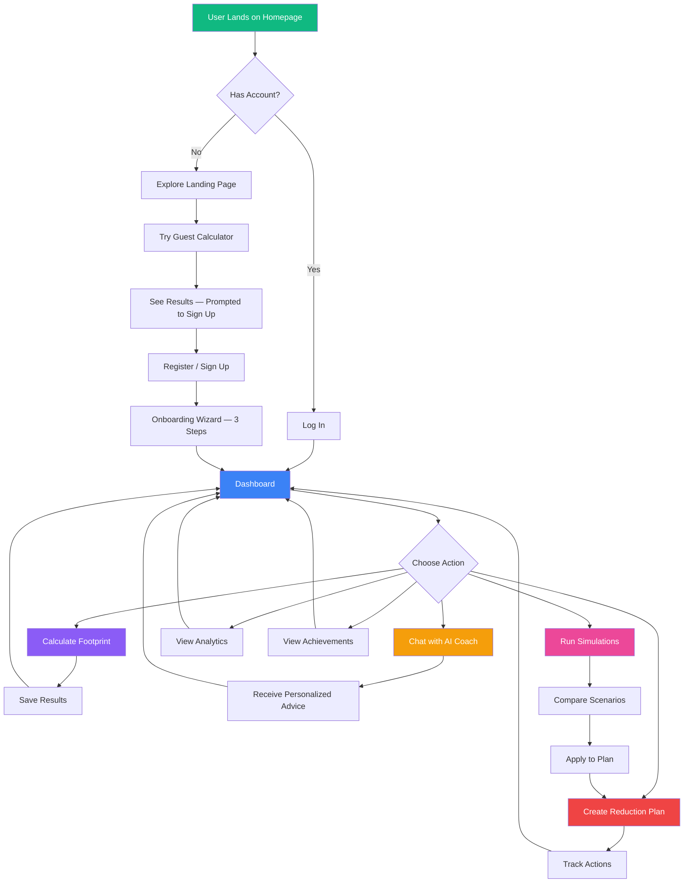
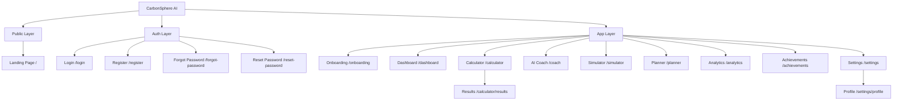
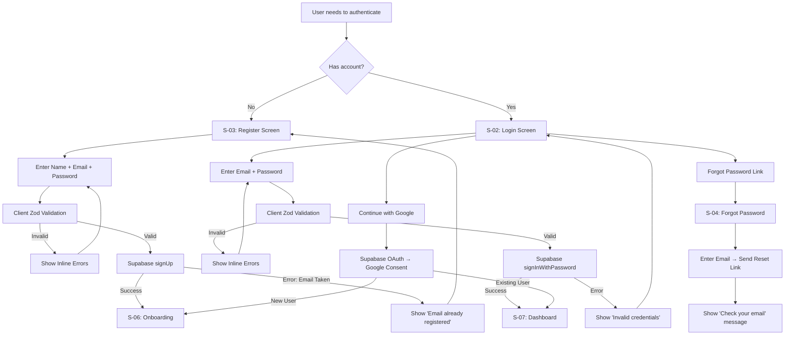
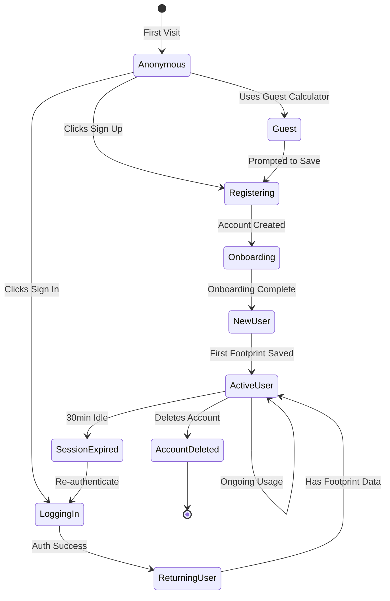
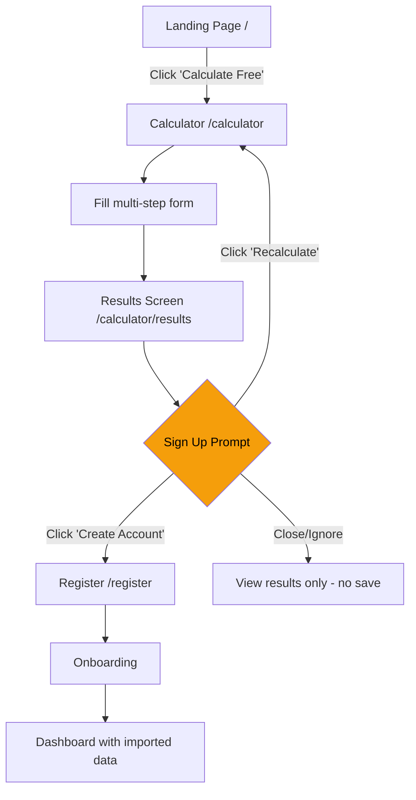
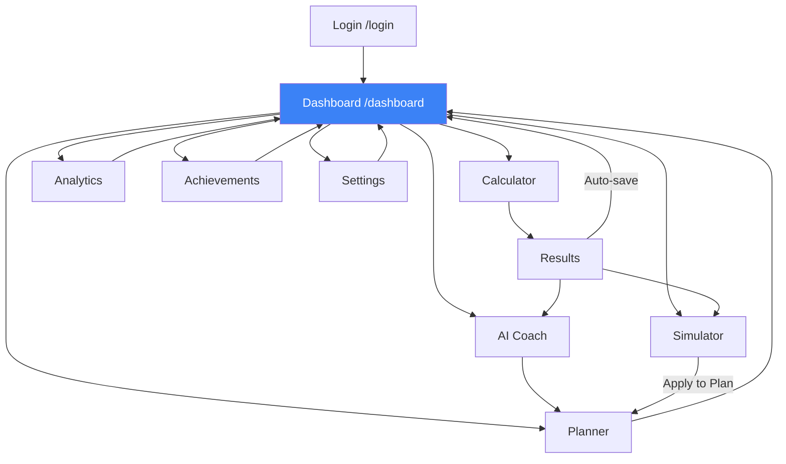
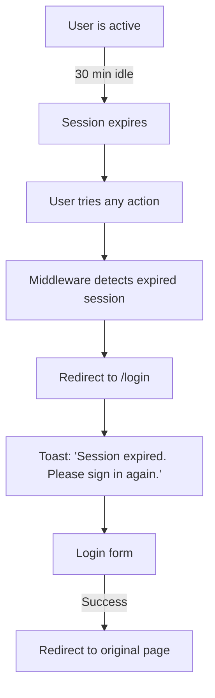
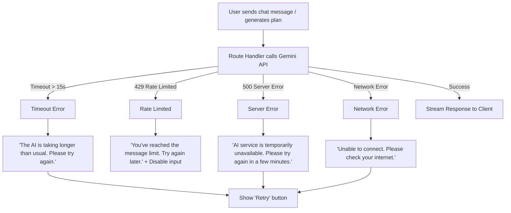
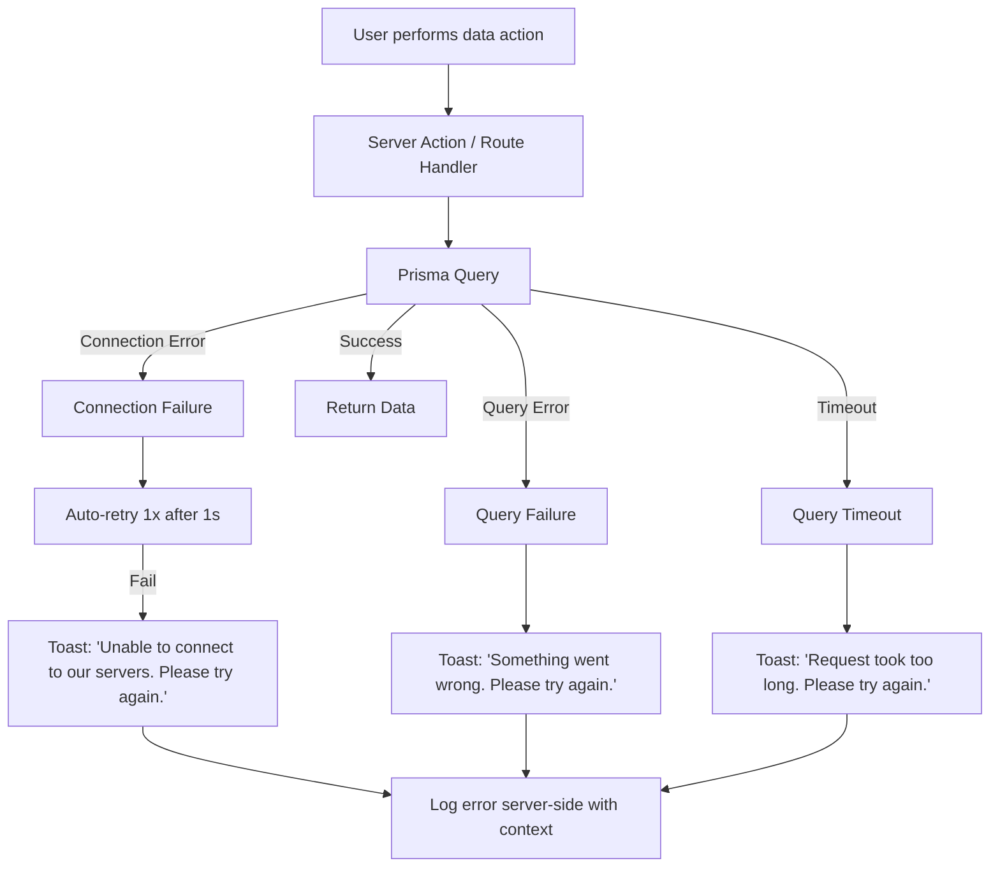
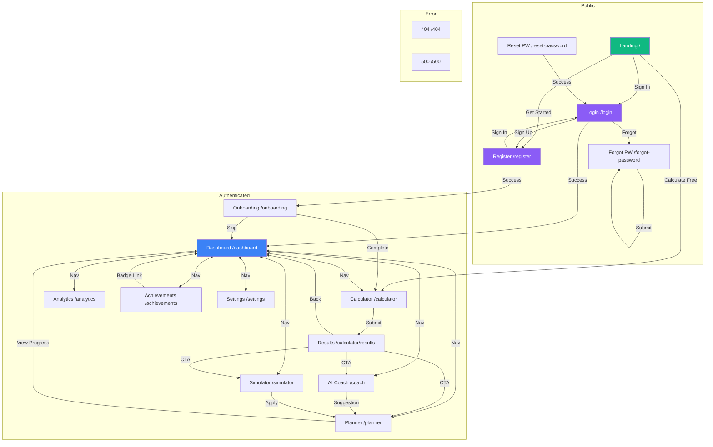

# CarbonSphere AI — App Flow Document

**Version:** 1.0
**Date:** June 8, 2026
**Author:** Principal UX Architect
**Status:** Draft — Ready for Implementation
**Project:** CarbonSphere AI ("Track Smarter. Live Greener.")

---

## Table of Contents

1. [Complete User Journey](#1-complete-user-journey)
2. [Screen Inventory](#2-screen-inventory)
3. [Navigation Structure](#3-navigation-structure)
4. [Information Architecture](#4-information-architecture)
5. [Landing Page Flow](#5-landing-page-flow)
6. [Authentication Flow](#6-authentication-flow)
7. [Onboarding Flow](#7-onboarding-flow)
8. [Dashboard Flow](#8-dashboard-flow)
9. [Calculator Flow](#9-calculator-flow)
10. [AI Coach Flow](#10-ai-coach-flow)
11. [Impact Simulator Flow](#11-impact-simulator-flow)
12. [Reduction Planner Flow](#12-reduction-planner-flow)
13. [Analytics Flow](#13-analytics-flow)
14. [Achievements Flow](#14-achievements-flow)
15. [Settings Flow](#15-settings-flow)
16. [Mobile Navigation Flow](#16-mobile-navigation-flow)
17. [Desktop Navigation Flow](#17-desktop-navigation-flow)
18. [User State Transitions](#18-user-state-transitions)
19. [Empty States](#19-empty-states)
20. [Error States](#20-error-states)
21. [Success States](#21-success-states)
22. [Loading States](#22-loading-states)
23. [Edge Cases](#23-edge-cases)
24. [Accessibility Flows](#24-accessibility-flows)
25. [Guest User Flow](#25-guest-user-flow)
26. [Registered User Flow](#26-registered-user-flow)
27. [Session Expiration Flow](#27-session-expiration-flow)
28. [AI Failure Flow](#28-ai-failure-flow)
29. [Database Failure Flow](#29-database-failure-flow)
30. [Complete Navigation Map](#30-complete-navigation-map)

---

## 1. Complete User Journey

### Primary Journey: First Visit → Active User



### Journey Stages

| Stage | Duration | Goal | Key Screens |
|---|---|---|---|
| **Discovery** | 0–30 seconds | Understand value proposition | Landing Page |
| **Trial** | 30 seconds–3 minutes | Experience calculator without commitment | Guest Calculator |
| **Conversion** | 1–2 minutes | Create account to save data | Register, Login |
| **Activation** | 2–5 minutes | Complete first footprint + set goal | Onboarding, Calculator |
| **Engagement** | Ongoing | Use coach, simulator, planner weekly | Dashboard, Coach, Simulator |
| **Retention** | Ongoing | Maintain streaks, earn badges, see progress | Achievements, Analytics |

### Micro-Journey: Daily Returning User (< 60 seconds)

```
Open App → Dashboard (see streak + stats) → Quick Log or Check Plan → Close
```

### Micro-Journey: Weekly Deep Session (5–15 minutes)

```
Open App → Dashboard → Recalculate Footprint → Chat with AI Coach → Run Simulation → Update Plan → Check Achievements → Close
```

---

## 2. Screen Inventory

### Complete Screen List

| # | Screen ID | Screen Name | Route | Auth Required | Layout |
|---|---|---|---|---|---|
| 1 | `S-01` | Landing Page | `/` | No | Public |
| 2 | `S-02` | Login | `/login` | No | Auth |
| 3 | `S-03` | Register | `/register` | No | Auth |
| 4 | `S-04` | Forgot Password | `/forgot-password` | No | Auth |
| 5 | `S-05` | Reset Password | `/reset-password` | No | Auth |
| 6 | `S-06` | Onboarding | `/onboarding` | Yes | Fullscreen |
| 7 | `S-07` | Dashboard | `/dashboard` | Yes | App Shell |
| 8 | `S-08` | Calculator | `/calculator` | Partial (guest OK) | App Shell |
| 9 | `S-09` | Calculator Results | `/calculator/results` | Partial (guest OK) | App Shell |
| 10 | `S-10` | AI Coach | `/coach` | Yes | App Shell |
| 11 | `S-11` | Impact Simulator | `/simulator` | Yes | App Shell |
| 12 | `S-12` | Reduction Planner | `/planner` | Yes | App Shell |
| 13 | `S-13` | Analytics | `/analytics` | Yes | App Shell |
| 14 | `S-14` | Achievements | `/achievements` | Yes | App Shell |
| 15 | `S-15` | Settings | `/settings` | Yes | App Shell |
| 16 | `S-16` | Profile | `/settings/profile` | Yes | App Shell |
| 17 | `S-17` | Not Found | `/404` | No | Minimal |
| 18 | `S-18` | Server Error | `/500` | No | Minimal |

---

## 3. Navigation Structure

### Primary Navigation Items (App Shell Sidebar / Bottom Bar)

| Order | Label | Icon | Route | Badge |
|---|---|---|---|---|
| 1 | Dashboard | `LayoutDashboard` | `/dashboard` | — |
| 2 | Calculator | `Calculator` | `/calculator` | — |
| 3 | AI Coach | `Bot` | `/coach` | Unread count |
| 4 | Simulator | `FlaskConical` | `/simulator` | — |
| 5 | Planner | `ListChecks` | `/planner` | Active tasks count |
| 6 | Analytics | `TrendingDown` | `/analytics` | — |
| 7 | Achievements | `Trophy` | `/achievements` | New badge dot |

### Secondary Navigation (User Menu — top-right avatar dropdown)

| Label | Icon | Route |
|---|---|---|
| Settings | `Settings` | `/settings` |
| Profile | `User` | `/settings/profile` |
| Theme Toggle | `Sun`/`Moon` | — (action) |
| Sign Out | `LogOut` | — (action) |

### Breadcrumb Strategy

No breadcrumbs needed — the app is single-level deep (flat IA). The active sidebar item serves as the location indicator.

---

## 4. Information Architecture



### Content Hierarchy Per Module

| Module | Primary Content | Secondary Content | Tertiary Content |
|---|---|---|---|
| Dashboard | Total footprint number | Category breakdown chart | Streak, recent badges, plan status |
| Calculator | Multi-step input form | Running total estimate | Helper text, tooltips |
| AI Coach | Chat message thread | Quick prompt buttons | Disclaimer |
| Simulator | Scenario toggle cards | Before/after comparison chart | Equivalency metrics |
| Planner | Action checklist | Progress bar + target info | AI-generated plan details |
| Analytics | Trend line chart | Comparison bar chart | Equivalency cards |
| Achievements | Badge grid | Streak counter | Progress indicators |

---

## 5. Landing Page Flow

### Screen: `S-01` Landing Page

| Attribute | Value |
|---|---|
| **Screen Name** | Landing Page |
| **Route** | `/` |
| **Purpose** | Convert visitors into users by communicating value proposition and offering a free trial (guest calculator) |

#### Components (Top to Bottom)

| # | Component | Description |
|---|---|---|
| 1 | **Navigation Bar** | Logo (left), nav links (Features, How It Works, About), CTA buttons: "Sign In" (ghost), "Get Started" (primary). Sticky on scroll. |
| 2 | **Hero Section** | Headline: "Track Smarter. Live Greener." · Subheadline: "AI-powered carbon footprint tracking that turns awareness into action." · Primary CTA: "Calculate Your Footprint — Free" · Secondary CTA: "Sign Up" · Animated earth/leaf illustration or gradient orb background. |
| 3 | **Social Proof Bar** | "Join 1,000+ people reducing their carbon footprint" (or similar aspirational metric). |
| 4 | **Features Grid** | 4-column grid (2×2 on mobile): Calculator, AI Coach, Simulator, Planner. Each: icon + title + 1-line description. |
| 5 | **How It Works** | 3-step horizontal stepper: (1) Calculate → (2) Get AI Insights → (3) Track & Reduce. With illustrations. |
| 6 | **Dashboard Preview** | Screenshot or mockup of the dashboard in a browser frame. Dark/light modes shown. |
| 7 | **CTA Section** | "Ready to make a difference?" · Primary CTA: "Start Free — No Credit Card" · Links to Register. |
| 8 | **Footer** | Logo, copyright, links: Privacy Policy, Terms, GitHub. Accessibility statement link. |

#### User Actions

| Action | Trigger | Target |
|---|---|---|
| Click "Calculate Your Footprint" | Primary hero CTA | `/calculator` (guest mode) |
| Click "Get Started" / "Sign Up" | Various CTAs | `/register` |
| Click "Sign In" | Navbar | `/login` |
| Scroll through page | Natural exploration | — |
| Click feature card | Feature grid | `/register` |

#### States

| State | Behavior |
|---|---|
| **Default** | Full marketing page rendered via Server Component (SSR). |
| **Authenticated Visit** | If user is logged in and visits `/`, redirect to `/dashboard`. |
| **Loading** | SSR — no loading state visible to user. |
| **Error** | Server error: render `global-error.tsx` with branded error page. |

---

## 6. Authentication Flow

### Flow Diagram



---

### Screen: `S-02` Login

| Attribute | Value |
|---|---|
| **Screen Name** | Login |
| **Route** | `/login` |
| **Purpose** | Authenticate existing users |

#### Components

| # | Component | Description |
|---|---|---|
| 1 | **App Logo** | CarbonSphere AI logo centered above form |
| 2 | **Page Title** | "Welcome back" · Subtitle: "Sign in to continue your sustainability journey" |
| 3 | **Google OAuth Button** | Full-width button: Google icon + "Continue with Google" |
| 4 | **Divider** | "or" divider between OAuth and email form |
| 5 | **Email Input** | Label: "Email address" · Type: email · Placeholder: "you@example.com" · Autocomplete: email |
| 6 | **Password Input** | Label: "Password" · Type: password · Toggle show/hide icon · Autocomplete: current-password |
| 7 | **Forgot Password Link** | Right-aligned text link below password: "Forgot password?" |
| 8 | **Submit Button** | Full-width primary button: "Sign In" · Loading state with spinner |
| 9 | **Register Link** | Bottom text: "Don't have an account? Sign up" |

#### User Actions

| Action | Trigger | Target |
|---|---|---|
| Submit login form | Click "Sign In" or press Enter | Supabase auth → `/dashboard` |
| Click "Continue with Google" | OAuth button | Google consent → `/dashboard` or `/onboarding` |
| Click "Forgot password?" | Text link | `/forgot-password` |
| Click "Sign up" | Text link | `/register` |

#### States

| State | Behavior |
|---|---|
| **Empty** | Form displayed with empty inputs, submit button enabled. |
| **Loading** | Submit button shows spinner, inputs disabled. "Signing in..." text. |
| **Error — Invalid Credentials** | Red alert banner above form: "Invalid email or password. Please try again." Inputs remain filled. |
| **Error — Network** | Red alert banner: "Unable to connect. Please check your internet and try again." |
| **Error — Rate Limited** | Red alert banner: "Too many attempts. Please wait a few minutes." |
| **Success** | Redirect to `/dashboard`. Brief green toast: "Welcome back, {name}!" |

---

### Screen: `S-03` Register

| Attribute | Value |
|---|---|
| **Screen Name** | Register |
| **Route** | `/register` |
| **Purpose** | Create new user accounts |

#### Components

| # | Component | Description |
|---|---|---|
| 1 | **App Logo** | CarbonSphere AI logo centered |
| 2 | **Page Title** | "Create your account" · Subtitle: "Start tracking your impact today" |
| 3 | **Google OAuth Button** | Full-width: "Continue with Google" |
| 4 | **Divider** | "or" divider |
| 5 | **Name Input** | Label: "Full name" · Type: text · Placeholder: "Jane Doe" · Autocomplete: name |
| 6 | **Email Input** | Label: "Email address" · Type: email · Autocomplete: email |
| 7 | **Password Input** | Label: "Password" · Type: password · Toggle show/hide · Autocomplete: new-password |
| 8 | **Password Strength Indicator** | Colored bar below password: Red (weak) → Yellow (fair) → Green (strong). Text hint: min 8 chars, 1 uppercase, 1 number. |
| 9 | **Submit Button** | Full-width: "Create Account" · Loading state with spinner |
| 10 | **Login Link** | "Already have an account? Sign in" |
| 11 | **Terms Text** | Small text: "By creating an account, you agree to our Terms of Service and Privacy Policy." |

#### Validation Rules (Zod)

| Field | Rules |
|---|---|
| Name | Required, 2–50 characters |
| Email | Required, valid email format |
| Password | Required, min 8 characters, 1 uppercase, 1 lowercase, 1 number |

#### States

| State | Behavior |
|---|---|
| **Empty** | Form with empty inputs. |
| **Validation Error** | Inline error messages beneath each invalid field. Red border on field. Error announced via `aria-describedby`. |
| **Error — Email Taken** | Alert: "An account with this email already exists. Sign in instead?" with link. |
| **Loading** | Spinner on button, inputs disabled. |
| **Success** | Redirect to `/onboarding`. Toast: "Account created! Let's get you started." |

---

### Screen: `S-04` Forgot Password

| Attribute | Value |
|---|---|
| **Screen Name** | Forgot Password |
| **Route** | `/forgot-password` |
| **Purpose** | Send password reset email |

#### Components

| # | Component | Description |
|---|---|---|
| 1 | **Logo** | Centered |
| 2 | **Title** | "Reset your password" · Subtitle: "Enter your email and we'll send you a reset link" |
| 3 | **Email Input** | Label: "Email address" |
| 4 | **Submit Button** | "Send Reset Link" |
| 5 | **Back to Login** | "← Back to sign in" link |

#### States

| State | Behavior |
|---|---|
| **Success** | Hide form. Show check icon + "Check your email" message + "We sent a reset link to {email}. Check your inbox and spam folder." + "Back to sign in" link. |
| **Error** | Alert: "Something went wrong. Please try again." |

---

### Screen: `S-05` Reset Password

| Attribute | Value |
|---|---|
| **Screen Name** | Reset Password |
| **Route** | `/reset-password` |
| **Purpose** | Set new password from email link |

#### Components

| # | Component | Description |
|---|---|---|
| 1 | **Title** | "Set new password" |
| 2 | **New Password Input** | With strength indicator |
| 3 | **Confirm Password Input** | Must match |
| 4 | **Submit Button** | "Update Password" |

#### States

| State | Behavior |
|---|---|
| **Success** | Redirect to `/login`. Toast: "Password updated. Please sign in." |
| **Error — Link Expired** | Message: "This reset link has expired. Request a new one." + link to `/forgot-password`. |

---

## 7. Onboarding Flow

### Screen: `S-06` Onboarding

| Attribute | Value |
|---|---|
| **Screen Name** | Onboarding Wizard |
| **Route** | `/onboarding` |
| **Purpose** | Welcome new users, collect preferences, guide to first calculation |

#### Layout

Full-screen centered card (no sidebar), progress indicator at top, step content in center, navigation buttons at bottom.

#### Steps

| Step | Content | Components | User Action |
|---|---|---|---|
| **Step 1: Welcome** | "Welcome to CarbonSphere AI, {name}! 🌍" · Brief explanation: "We help you understand and reduce your carbon footprint with AI-powered insights." | Illustration, welcome text | Click "Let's Go →" |
| **Step 2: Preferences** | "Quick setup" · Select preferred unit system (Metric / Imperial). Select theme (Light / Dark / System). | Radio group for units, theme toggle buttons | Click "Next →" |
| **Step 3: First Action** | "You're all set! Start by calculating your carbon footprint." | CTA card with calculator icon | Click "Calculate My Footprint →" redirects to `/calculator` |

#### Navigation

| Action | Target |
|---|---|
| Complete step 3 | `/calculator` |
| Click "Skip" (on any step) | `/dashboard` |
| Click "←" | Previous step |
| Close browser / navigate away | Onboarding resumes on next login (flag: `onboardingComplete: false`) |

#### States

| State | Behavior |
|---|---|
| **Default** | Step 1 shown on first load after registration. |
| **Already Completed** | If `onboardingComplete === true`, redirect to `/dashboard`. |
| **Loading** | Preferences save has brief spinner on "Next" button. |
| **Error** | Toast: "Couldn't save preferences. You can update them later in Settings." Proceed anyway. |

---

## 8. Dashboard Flow

### Screen: `S-07` Dashboard

| Attribute | Value |
|---|---|
| **Screen Name** | Dashboard |
| **Route** | `/dashboard` |
| **Purpose** | Central hub — overview of footprint, progress, and next actions |

#### Components (Layout Grid)

| # | Component | Grid Position | Description |
|---|---|---|---|
| 1 | **Page Header** | Full width | "Your Carbon Dashboard" title + date filter dropdown (7d / 30d / 90d / 1y / All) |
| 2 | **Total Footprint Card** | Left 1/3 | Large number: "4,250 kg CO₂e/year" · Trend badge: "↓ 12% from last month" (green) or "↑ 5%" (red). Subtitle: "Annual carbon footprint" |
| 3 | **Goal Progress Card** | Center 1/3 | Circular progress gauge or arc. "35% toward your goal" · Goal details: "Target: 3,400 kg CO₂e" · If no goal: CTA "Set a Goal →" |
| 4 | **Streak Card** | Right 1/3 | 🔥 "7 Day Streak" · "Your best: 14 days" · Last activity date |
| 5 | **Category Breakdown Chart** | Left 2/3 | Interactive donut chart (Recharts). Segments: Transportation, Energy, Diet, Shopping, Waste. Click segment → tooltip with kg and %. Hidden accessible data table. |
| 6 | **Quick Actions Card** | Right 1/3 | Stacked action buttons: "Recalculate Footprint" → `/calculator`, "Chat with AI Coach" → `/coach`, "Run Simulation" → `/simulator` |
| 7 | **Trend Chart** | Full width | Line chart showing footprint over time. X-axis: dates. Y-axis: kg CO₂e. National average line (dashed). Global average line (dotted). Responds to date filter. Hidden accessible data table. |
| 8 | **Equivalency Cards** | Bottom row, 3 columns | 🌳 "Equivalent to X trees planted" · 🚗 "X fewer km driven" · ⛽ "X gallons of gas saved" |
| 9 | **Recent Achievements** | Bottom left | Last 3 badges earned with name. "View All →" link to `/achievements`. |
| 10 | **Plan Status Card** | Bottom right | Active plan name + progress bar. "Next action: {action name}" · "View Plan →" link to `/planner`. If no plan: "Create a Plan →" |

#### User Actions

| Action | Trigger | Target |
|---|---|---|
| Change date filter | Dropdown selection | Refilter trend chart + stats |
| Click donut segment | Chart interaction | Show tooltip with category detail |
| Click "Recalculate Footprint" | Quick action button | `/calculator` |
| Click "Chat with AI Coach" | Quick action button | `/coach` |
| Click "Run Simulation" | Quick action button | `/simulator` |
| Click "Set a Goal" | Goal card CTA | `/planner` |
| Click "View All" achievements | Link | `/achievements` |
| Click "View Plan" | Link | `/planner` |

#### Empty State

> **When:** User has never calculated a footprint.
>
> **Display:** Replace the entire dashboard grid with a centered empty state card:
> - Illustration: Globe or leaf graphic
> - Headline: "Welcome to CarbonSphere AI!"
> - Body: "Calculate your first carbon footprint to unlock your personalized dashboard."
> - Primary CTA: "Calculate My Footprint →" (links to `/calculator`)
> - Secondary text: "It only takes 2 minutes."

#### Error State

> **When:** Data fetch fails.
>
> **Display:** Alert banner at top of page:
> - Icon: Warning triangle
> - Message: "We couldn't load your dashboard data. Please try again."
> - Action: "Retry" button that triggers re-fetch.
> - Individual chart components show skeleton placeholders.

#### Success State

> **When:** Fresh data loaded or after new calculation saved.
>
> **Display:** Dashboard renders fully. If a new calculation was just saved, show a brief toast: "✅ Footprint updated! Your dashboard reflects your latest data."

---

## 9. Calculator Flow

### Flow Diagram

```mermaid
flowchart TD
    Start[User opens /calculator]
    Start --> Step1[Step 1: Transportation]
    Step1 --> Step2[Step 2: Energy]
    Step2 --> Step3[Step 3: Diet]
    Step3 --> Step4[Step 4: Shopping]
    Step4 --> Step5[Step 5: Waste]
    Step5 --> Review[Review & Submit]
    Review --> Results[S-09: Results Screen]

    Results --> Auth{Authenticated?}
    Auth -->|Yes| Save[Save to Profile → Dashboard]
    Auth -->|No| Prompt[Prompt: Sign Up to Save]
    Prompt --> Register[/register]
```

### Screen: `S-08` Calculator

| Attribute | Value |
|---|---|
| **Screen Name** | Carbon Footprint Calculator |
| **Route** | `/calculator` |
| **Purpose** | Multi-step form to collect emission data across 5 categories |

#### Layout

- **Progress Bar:** Top of form area. Shows current step (1/5) with labeled category names. Steps are clickable to jump back.
- **Running Total:** Sticky floating card (top-right on desktop, bottom sheet on mobile) showing real-time estimate: "Estimated: 4,250 kg CO₂e/year" that updates as inputs change.
- **Step Content:** Center card with category-specific form fields.
- **Navigation Buttons:** Bottom of card: "← Back" (ghost) and "Next →" (primary). Step 5 shows "Review →". Step labels announce to screen readers.

#### Step Details

**Step 1: Transportation 🚗**

| Field | Component | Props |
|---|---|---|
| Daily car commute distance | `NumberInput` | Label: "Daily car commute distance", Unit: "km", Default: 0, Min: 0, Max: 500, Helper: "Round trip distance you drive each day" |
| Car fuel type | `Select` | Label: "Car fuel type", Options: ["No Car", "Gasoline", "Diesel", "Hybrid", "Electric"], Default: "Gasoline" |
| Weekly public transit trips | `NumberInput` | Label: "Public transit trips per week", Unit: "trips", Default: 0, Min: 0, Max: 50 |
| Short-haul flights per year | `NumberInput` | Label: "Short flights per year (< 3 hours)", Unit: "flights", Default: 0, Min: 0, Max: 50, Helper: "Domestic or short international flights" |
| Long-haul flights per year | `NumberInput` | Label: "Long flights per year (> 3 hours)", Unit: "flights", Default: 0, Min: 0, Max: 20 |

**Step 2: Energy ⚡**

| Field | Component | Props |
|---|---|---|
| Monthly electricity usage | `NumberInput` | Label: "Monthly electricity usage", Unit: "kWh", Default: 300, Min: 0, Max: 5000 |
| Electricity source | `Select` | Label: "Electricity source", Options: ["Grid Mix", "Partial Renewable", "100% Renewable"], Default: "Grid Mix" |
| Monthly natural gas | `NumberInput` | Label: "Monthly natural gas usage", Unit: "therms", Default: 30, Min: 0, Max: 500 |
| Heating type | `Select` | Label: "Home heating type", Options: ["Natural Gas", "Electric", "Heat Pump", "Oil", "Wood", "None"], Default: "Natural Gas" |
| Household members | `NumberInput` | Label: "People in your household", Unit: "people", Default: 1, Min: 1, Max: 20, Helper: "Energy emissions are divided per person" |

**Step 3: Diet 🥗**

| Field | Component | Props |
|---|---|---|
| Diet type | `RadioGroup` (visual cards) | Label: "How would you describe your diet?", Options: ["Vegan 🌱", "Vegetarian 🥚", "Pescatarian 🐟", "Omnivore 🍽️", "Heavy Meat 🥩"], Default: "Omnivore" |
| Meals eaten out per week | `Slider` | Label: "Meals eaten out per week", Min: 0, Max: 21, Default: 3, Shows current value |
| Food waste | `RadioGroup` | Label: "How much food do you waste?", Options: ["Low (< 10%)", "Average (10–30%)", "High (> 30%)"], Default: "Average" |

**Step 4: Shopping 🛍️**

| Field | Component | Props |
|---|---|---|
| Monthly clothing spend | `NumberInput` | Label: "Monthly spending on new clothing", Unit: "$", Default: 50, Min: 0, Max: 5000 |
| Monthly electronics spend | `NumberInput` | Label: "Monthly spending on electronics", Unit: "$", Default: 30, Min: 0, Max: 5000 |
| Monthly other goods spend | `NumberInput` | Label: "Monthly spending on other goods", Unit: "$", Default: 100, Min: 0, Max: 10000 |
| Used goods preference | `Select` | Label: "Do you buy used or refurbished?", Options: ["Never", "Sometimes", "Mostly", "Always"], Default: "Sometimes" |

**Step 5: Waste ♻️**

| Field | Component | Props |
|---|---|---|
| Recycling frequency | `RadioGroup` (visual) | Label: "How often do you recycle?", Options: ["Never", "Sometimes", "Usually", "Always"], Default: "Sometimes" |
| Composting | `Switch` | Label: "Do you compost?", Default: false |
| Weekly trash bags | `Slider` | Label: "Trash bags per week", Min: 0, Max: 20, Default: 2 |

#### User Actions

| Action | Trigger | Target |
|---|---|---|
| Fill in fields | Form inputs | Updates running total in real-time |
| Click "Next →" | Button | Advance to next step (with validation) |
| Click "← Back" | Button | Return to previous step (data preserved) |
| Click progress step | Progress bar | Jump to any completed or current step |
| Click "Review →" (Step 5) | Button | Show review screen |
| Click "Calculate & Save" (Review) | Button | Save to DB → Navigate to results |

#### Empty State

Not applicable — form always has defaults.

#### Error State

| Error | Display |
|---|---|
| Validation failure | Inline error text below field (red). Field border turns red. Focus moves to first error. `aria-invalid="true"` and `aria-describedby` set. |
| Save failure | Toast: "Couldn't save your results. Please try again." + Retry button. |

#### Success State

After submission: redirect to `/calculator/results` with the saved record ID.

---

### Screen: `S-09` Calculator Results

| Attribute | Value |
|---|---|
| **Screen Name** | Calculator Results |
| **Route** | `/calculator/results` |
| **Purpose** | Display footprint results with visual breakdown and comparison |

#### Components

| # | Component | Description |
|---|---|---|
| 1 | **Hero Result** | Large centered number: "Your annual carbon footprint: **4,250 kg CO₂e**" · Color-coded badge (green/yellow/red based on comparison to global avg) · Subtitle: "That's X% above/below the global average (4,700 kg)" |
| 2 | **Category Breakdown** | Horizontal bar chart or donut chart showing 5 categories with kg and %. Interactive — hover/click shows details. |
| 3 | **Comparison Chart** | Grouped bar chart: "You" vs "National Avg (16,000 kg)" vs "Global Avg (4,700 kg)". |
| 4 | **Top Insight** | Card: "💡 Your biggest impact area is **Transportation** at 1,800 kg CO₂e/year. Switching to public transit could save up to 1,100 kg." |
| 5 | **Action Buttons** | "Chat with AI Coach →" · "Run a Simulation →" · "Create Reduction Plan →" · "Back to Dashboard" |
| 6 | **Guest Prompt** (guest only) | Banner: "Sign up to save your results and track your progress over time." + "Create Free Account" button. |

#### User Actions

| Action | Trigger | Target |
|---|---|---|
| Click "Chat with AI Coach" | Button | `/coach` |
| Click "Run a Simulation" | Button | `/simulator` |
| Click "Create Reduction Plan" | Button | `/planner` |
| Click "Back to Dashboard" | Button | `/dashboard` |
| Click "Create Free Account" (guest) | Button | `/register` |
| Click "Recalculate" | Link/button | `/calculator` (reset form) |

---

## 10. AI Coach Flow

### Screen: `S-10` AI Coach

| Attribute | Value |
|---|---|
| **Screen Name** | AI Sustainability Coach |
| **Route** | `/coach` |
| **Purpose** | Conversational AI for personalized sustainability advice |

#### Layout

Full-height chat interface. Messages on left (AI) and right (user). Input bar fixed at bottom.

#### Components

| # | Component | Description |
|---|---|---|
| 1 | **Page Header** | "AI Sustainability Coach" · Subtitle: "Ask me anything about reducing your carbon footprint" |
| 2 | **Chat Thread** | Scrollable message list. AI messages: left-aligned, with bot avatar. User messages: right-aligned, with user avatar. Messages support markdown rendering. |
| 3 | **Quick Prompt Chips** | Shown when chat is empty or above input: "What's my biggest impact area?", "Give me 3 easy wins", "How can I reduce transportation emissions?", "Compare my footprint to the average" |
| 4 | **Message Input** | Text area (auto-grow, max 3 lines) + Send button (icon). Placeholder: "Ask about your carbon footprint..." |
| 5 | **AI Typing Indicator** | Three bouncing dots shown while AI is generating. |
| 6 | **Disclaimer Footer** | Subtle text below input: "AI-generated advice. Emission estimates are approximate." |
| 7 | **Rate Limit Indicator** | Small text: "15 / 20 messages remaining today" |

#### User Actions

| Action | Trigger | Target |
|---|---|---|
| Type message and press Enter/Send | Input + button/key | Send message to Gemini via streaming API |
| Click quick prompt chip | Chip button | Auto-sends that prompt |
| Scroll up | Scroll | View conversation history |
| Click "New Conversation" | Header button | Clear chat history, start fresh |

#### Empty State

> **When:** First visit, no messages yet.
>
> **Display:**
> - Centered AI avatar with greeting: "Hi {name}! 👋 I'm your AI sustainability coach."
> - "I've analyzed your carbon footprint. Ask me anything, or try one of these:"
> - Quick prompt chips displayed prominently
> - If no footprint data: "Calculate your footprint first for personalized advice." + CTA to `/calculator`

#### Error State

| Error | Display |
|---|---|
| API error | AI message bubble (red-tinted): "I'm having trouble connecting right now. Please try again." + "Retry" button in the message. |
| Rate limit reached | Disable input. Show message: "You've reached the daily limit of 20 messages. Come back tomorrow! 🌱" |
| No footprint data | Info banner at top: "For personalized advice, calculate your footprint first." + link to `/calculator`. Coach still functional but gives generic advice. |

#### Success State

Messages stream in token-by-token with a typing animation. Smooth scroll to newest message.

---

## 11. Impact Simulator Flow

### Screen: `S-11` Impact Simulator

| Attribute | Value |
|---|---|
| **Screen Name** | Carbon Impact Simulator |
| **Route** | `/simulator` |
| **Purpose** | Interactive what-if scenarios to preview lifestyle change impacts |

#### Components

| # | Component | Description |
|---|---|---|
| 1 | **Page Header** | "Impact Simulator" · Subtitle: "See how lifestyle changes could reduce your footprint" |
| 2 | **Current Footprint Summary** | Card: "Your current footprint: **4,250 kg CO₂e/year**" |
| 3 | **Scenario Cards Grid** | 3-column grid (1-column mobile). Each card: category icon + scenario name + estimated savings + toggle switch. Cards grouped by category with section headers (Transportation, Energy, Diet, Shopping, Waste). |
| 4 | **Before/After Comparison** | Side-by-side or stacked bar chart: "Current" bar vs "Projected" bar. Difference highlighted. Animates on toggle. |
| 5 | **Impact Summary Card** | "Potential savings: **1,855 kg CO₂e/year** (43% reduction)" · Updates live as toggles change. Equivalency: "That's like planting 30 trees 🌳" |
| 6 | **Apply to Plan CTA** | Button: "Apply These Changes to My Plan →" (disabled if nothing toggled). Links to `/planner` with selected scenarios pre-loaded. |

#### Scenario Cards (12 Total)

Each card contains:
```
┌─────────────────────────────────────────┐
│ 🚗 Transportation                       │
│                                         │
│ Switch to Electric Vehicle              │
│ Save ~2,000 kg CO₂e/year               │
│                                   [ON]  │
└─────────────────────────────────────────┘
```

#### User Actions

| Action | Trigger | Target |
|---|---|---|
| Toggle scenario ON/OFF | Switch on card | Recalculate projected footprint, update chart |
| Hover/focus scenario card | Mouse/keyboard | Show additional detail tooltip |
| Click "Apply to Plan" | CTA button | `/planner?scenarios=SIM-01,SIM-03,...` |
| Click "Reset All" | Text button | Turn all toggles off |

#### Empty State

> **When:** No footprint data exists.
>
> **Display:** Centered card: "Calculate your footprint first to run simulations." · CTA: "Go to Calculator →"

#### Error State

Toast: "Couldn't load simulation data. Please refresh."

#### Success State

Chart animates smoothly between before/after. Impact summary updates in real-time. Green highlight on savings number.

---

## 12. Reduction Planner Flow

### Screen: `S-12` Reduction Planner

| Attribute | Value |
|---|---|
| **Screen Name** | Reduction Planner |
| **Route** | `/planner` |
| **Purpose** | AI-generated action plan with goal tracking |

#### Components — No Active Plan

| # | Component | Description |
|---|---|---|
| 1 | **Page Header** | "Reduction Planner" · Subtitle: "Set a goal and get a personalized action plan" |
| 2 | **Goal Setting Card** | Target reduction: Select dropdown [10%, 20%, 30%, 50%]. Timeframe: Select dropdown [3 months, 6 months, 12 months]. Current footprint shown for reference. |
| 3 | **Generate Plan CTA** | "Generate My Plan with AI ✨" button. Loading state: "Our AI is creating your plan..." with progress spinner (takes 3–8 seconds). |

#### Components — Active Plan

| # | Component | Description |
|---|---|---|
| 1 | **Plan Header** | Plan name (AI-generated). Target: "Reduce by 20% (850 kg) in 6 months." |
| 2 | **Overall Progress Bar** | Horizontal bar: X% complete. "8 of 12 actions completed" |
| 3 | **Action Checklist** | Scrollable list of actions. Each action: checkbox + title + category tag + estimated savings + difficulty badge (Easy/Medium/Hard) + description (expandable). Actions sorted by week. |
| 4 | **Weekly Sections** | Actions grouped by "Week 1", "Week 2", etc. |
| 5 | **Plan Stats Card** | "Estimated total savings: 850 kg/year" · "Actions completed: 8/12" · "Time remaining: 4 months" |
| 6 | **Abandon Plan** | Subtle text link: "Start Over" → confirmation dialog |

#### User Actions

| Action | Trigger | Target |
|---|---|---|
| Set target + timeframe | Dropdowns | Updates projected savings |
| Click "Generate Plan" | Button | Calls Gemini API → creates plan |
| Check/uncheck action | Checkbox | Marks action complete/incomplete → updates progress |
| Expand action | Click/keyboard | Shows detailed description |
| Click "Start Over" | Text link | Confirmation dialog → deletes plan → shows goal setting |

#### Empty State

> **When:** No plan exists.
>
> **Display:** Goal Setting Card (Component #2 above) with illustration and encouraging copy: "Let AI create a personalized plan to reduce your carbon footprint."

#### Error State

| Error | Display |
|---|---|
| AI generation fails | Alert: "Couldn't generate your plan. Please try again." + "Retry" button |
| Save fails | Toast: "Couldn't update your plan. Please try again." |

#### Success State

Plan generated: Card slides in with celebration animation. Toast: "🎯 Your personalized plan is ready!" First action highlighted.

---

## 13. Analytics Flow

### Screen: `S-13` Analytics

| Attribute | Value |
|---|---|
| **Screen Name** | Progress Analytics |
| **Route** | `/analytics` |
| **Purpose** | Historical data visualization and insights |

#### Components

| # | Component | Description |
|---|---|---|
| 1 | **Page Header** | "Progress Analytics" · Date range filter (7d / 30d / 90d / 1y / All) |
| 2 | **Summary Cards Row** | 3 cards: "Cumulative CO₂e Saved: 850 kg" · "Calculations Logged: 12" · "Current Streak: 7 days 🔥" |
| 3 | **Trend Chart** | Line chart — footprint over time. Multiple data points. National/global average reference lines (dashed). |
| 4 | **Category Comparison Chart** | Stacked area or grouped bar chart showing how each category has changed over time. |
| 5 | **Month-over-Month Change** | Table or card list: "Nov → Dec: ↓ 150 kg (−8%)" with green/red indicators. |
| 6 | **Equivalency Section** | 3 cards with icons: 🌳 Trees Planted equivalent · 🚗 Km Not Driven · ⛽ Gallons Saved |
| 7 | **AI Insights Card** | "💡 Top Insights" — 3 bullet points generated from data trends. E.g., "Your transportation emissions dropped 25% since switching to hybrid." |

#### User Actions

| Action | Trigger | Target |
|---|---|---|
| Change date range | Filter dropdown | Refresh all charts and summaries |
| Hover chart data point | Mouse/keyboard | Tooltip with exact value and date |
| Click "View Details" on insight | Card link | Relevant section or coach |

#### Empty State

> **When:** Fewer than 2 calculations saved.
>
> **Display:** Centered message: "Track your progress over time." · "You need at least 2 calculations to see trends." · CTA: "Calculate Again →" linking to `/calculator`.

---

## 14. Achievements Flow

### Screen: `S-14` Achievements

| Attribute | Value |
|---|---|
| **Screen Name** | Achievements |
| **Route** | `/achievements` |
| **Purpose** | Display earned and available badges, streaks, and milestones |

#### Components

| # | Component | Description |
|---|---|---|
| 1 | **Page Header** | "Achievements" · Subtitle: "Track your milestones and celebrate your impact" |
| 2 | **Streak Section** | Large display: 🔥 "7 Day Streak" · "Best streak: 14 days" · "Keep it going!" |
| 3 | **Stats Row** | "X of 12 badges earned" · "Total CO₂e saved: X kg" · "Member since: {date}" |
| 4 | **Badge Grid** | 4-column grid (2 on mobile). Each badge card: emoji icon (large) + name + description + status (Earned with date / Locked with progress). Earned badges: full color, checkmark. Locked badges: grayscale with progress bar (e.g., "3/10 messages sent"). |

#### Badge Card Design

**Earned:**
```
┌───────────────────┐
│       🌱          │ (full color, large)
│    First Step     │
│  ✅ Earned Jun 1  │
└───────────────────┘
```

**Locked:**
```
┌───────────────────┐
│       🔬          │ (grayscale, faded)
│    Scientist      │
│  ████░░░░ 3/5     │
│  Run 5 simulations│
└───────────────────┘
```

#### User Actions

| Action | Trigger | Target |
|---|---|---|
| View badge details | Click/tap badge card | Expand card or show modal with full criteria and progress |
| Share badge (future) | Share button on earned badge | Native share dialog |

#### Empty State

> **When:** No badges earned yet (new user who hasn't calculated).
>
> **Display:** All 12 badges shown in locked/grayscale state. Encouraging header: "Start your journey! Complete your first calculation to earn the 🌱 First Step badge."

#### Success State — Badge Unlocked Notification

This appears as a toast notification **anywhere in the app** when a badge is earned:

```
┌───────────────────────────────────────┐
│ 🏆 Achievement Unlocked!             │
│                                       │
│ 🌱 First Step                         │
│ You completed your first calculation! │
│                                       │
│           [View Achievements]         │
└───────────────────────────────────────┘
```

- Duration: 5 seconds auto-dismiss, or click to dismiss.
- Announced via `aria-live="polite"`.
- Click "View Achievements" → `/achievements`.

---

## 15. Settings Flow

### Screen: `S-15` Settings

| Attribute | Value |
|---|---|
| **Screen Name** | Settings |
| **Route** | `/settings` |
| **Purpose** | User preferences and account management |

#### Components

| # | Section | Fields |
|---|---|---|
| 1 | **Appearance** | Theme toggle: Light / Dark / System (radio group) |
| 2 | **Units** | Unit system: Metric / Imperial (radio group) |
| 3 | **Account** | Email (read-only display) · Name (editable text input) · "Update Profile" button |
| 4 | **Danger Zone** | "Delete Account" button (red, outlined). Triggers confirmation dialog: "This will permanently delete your account and all data. This action cannot be undone." → "Cancel" / "Delete My Account" |

#### User Actions

| Action | Trigger | Target |
|---|---|---|
| Change theme | Radio group | Applies immediately, saved to profile |
| Change units | Radio group | Applies immediately, saved to profile |
| Update name | Text input + save button | Server action → toast: "Profile updated." |
| Delete account | Button → dialog → confirm | Supabase delete → redirect to `/` with toast: "Account deleted." |

#### States

| State | Behavior |
|---|---|
| **Loading** | Skeleton placeholders for current settings values. |
| **Save Error** | Toast: "Couldn't save settings. Please try again." |
| **Delete Confirmation** | Modal dialog with destructive confirmation. Focus trapped. |

---

## 16. Mobile Navigation Flow

### Layout: Bottom Tab Bar

On screens **< 768px** wide, the primary navigation renders as a fixed bottom tab bar.

```
┌─────────────────────────────────────────┐
│                                         │
│            Page Content                 │
│                                         │
├─────┬──────┬───────┬───────┬───────────┤
│ 📊  │ 🔢   │ 🤖    │ 🔬    │ ☰ More   │
│Dash │Calc  │Coach  │ Sim   │           │
└─────┴──────┴───────┴───────┴───────────┘
```

| Tab | Label | Route |
|---|---|---|
| 📊 | Dashboard | `/dashboard` |
| 🔢 | Calculator | `/calculator` |
| 🤖 | Coach | `/coach` |
| 🔬 | Simulator | `/simulator` |
| ☰ | More | Opens sheet with: Planner, Analytics, Achievements, Settings |

### "More" Sheet Items

| Item | Icon | Route |
|---|---|---|
| Reduction Planner | `ListChecks` | `/planner` |
| Analytics | `TrendingDown` | `/analytics` |
| Achievements | `Trophy` | `/achievements` |
| Settings | `Settings` | `/settings` |
| Sign Out | `LogOut` | — (action) |

### Mobile-Specific Behaviors

| Behavior | Implementation |
|---|---|
| Active tab indicator | Filled icon + colored label for active tab |
| Tab bar hiding | Hides on scroll down, shows on scroll up (optional — evaluate for UX) |
| Gesture navigation | Swipe right/left between adjacent tabs (optional enhancement) |
| Safe area | Bottom padding for iOS home indicator |

---

## 17. Desktop Navigation Flow

### Layout: Sidebar

On screens **≥ 768px**, navigation renders as a collapsible left sidebar.

```
┌──────────────┬──────────────────────────────┐
│ 🌍 Carbon    │                              │
│ Sphere AI    │                              │
│              │        Page Content           │
│ ━━━━━━━━━━━━ │                              │
│ 📊 Dashboard │                              │
│ 🔢 Calculator│                              │
│ 🤖 AI Coach  │                              │
│ 🔬 Simulator │                              │
│ 📋 Planner   │                              │
│ 📈 Analytics │                              │
│ 🏆 Achieve…  │                              │
│              │                              │
│ ━━━━━━━━━━━━ │                              │
│ ⚙️ Settings  │                              │
│              │                              │
│ ━━━━━━━━━━━━ │                              │
│ 👤 Het Patel │                              │
│    Sign Out  │                              │
└──────────────┴──────────────────────────────┘
```

### Sidebar Behaviors

| Behavior | Implementation |
|---|---|
| Collapsed mode | Icon-only sidebar (~64px wide). Toggled via hamburger button at top. Tooltips show label on hover. |
| Expanded mode | Full sidebar (~256px wide) showing icon + label. |
| Active indicator | Left border accent + background highlight on active item. |
| User section | Bottom of sidebar: avatar + name + sign-out button. |
| Collapse persistence | State saved in localStorage. |
| Keyboard | All items are focusable, `Tab` navigates, `Enter` activates. |

---

## 18. User State Transitions



### State Definitions

| State | Has Account | Has Session | Has Footprint | Can Access |
|---|---|---|---|---|
| **Anonymous** | No | No | No | Landing Page only |
| **Guest** | No | No | In memory only | Calculator (no save) |
| **Registering** | Creating | No | No | Auth pages |
| **Onboarding** | Yes | Yes | No | Onboarding wizard |
| **NewUser** | Yes | Yes | No | All pages (empty states) |
| **ActiveUser** | Yes | Yes | Yes | All pages (full data) |
| **ReturningUser** | Yes | Yes | Maybe | All pages |
| **SessionExpired** | Yes | No | Yes (in DB) | Redirect to login |

---

## 19. Empty States

Every screen must handle the case where no data exists yet. Each empty state must include:
1. An illustrative icon or graphic (not a broken/error image).
2. A clear, encouraging headline.
3. A brief description of what the user needs to do.
4. A single, prominent CTA button.

| Screen | Headline | Description | CTA |
|---|---|---|---|
| Dashboard | "Welcome to CarbonSphere AI!" | "Calculate your first carbon footprint to unlock your personalized dashboard." | "Calculate My Footprint →" → `/calculator` |
| Calculator Results | *(N/A — always has data after calculation)* | — | — |
| AI Coach (no footprint) | "Let's get started!" | "Calculate your footprint first so I can give you personalized advice." | "Go to Calculator →" → `/calculator` |
| AI Coach (no messages) | "Hi {name}! 👋" | "Ask me anything about reducing your carbon footprint, or try a quick prompt below." | Quick prompt chips |
| Simulator (no footprint) | "Nothing to simulate yet" | "Calculate your footprint first to see how changes could reduce your impact." | "Calculate First →" → `/calculator` |
| Planner (no plan) | "Ready to make a plan?" | "Set a reduction target and let AI create your personalized action plan." | Goal setting form |
| Analytics (< 2 records) | "Track your progress over time" | "Log at least 2 calculations to start seeing trends and insights." | "Calculate Again →" → `/calculator` |
| Achievements (none earned) | "Your journey starts here" | "Complete your first calculation to earn the 🌱 First Step badge." | "Start Calculating →" → `/calculator` |

---

## 20. Error States

### Global Error Patterns

| Error Type | UI Pattern | Components |
|---|---|---|
| **Field Validation** | Inline error beneath field | Red border, red text, `aria-invalid`, `aria-describedby` linking to error message |
| **Form Submission** | Alert banner above form | Warning icon, error message, retry suggestion |
| **API Failure** | Toast notification (destructive variant) | Red toast, error message, dismiss button |
| **Page-Level Error** | Full-page error boundary (`error.tsx`) | Error illustration, "Something went wrong", "Try Again" button, "Go Home" link |
| **Network Offline** | Persistent top banner | "You're offline. Some features may be unavailable." Yellow banner. |
| **404 Not Found** | Full-page | Illustration, "Page not found", "Go to Dashboard" button |

### Error Message Guidelines

- **Do:** "We couldn't save your data. Please try again."
- **Don't:** "Error 500: Internal Server Error — Prisma Client request failed."
- **Do:** "Invalid email address. Please check and try again."
- **Don't:** "Zod validation error: string.email()"
- Always provide a **next action** (retry, go back, contact support).

---

## 21. Success States

| Trigger | UI Pattern | Message | Duration |
|---|---|---|---|
| Footprint saved | Green toast | "✅ Footprint saved successfully!" | 4 seconds |
| Plan generated | Green toast + animation | "🎯 Your personalized plan is ready!" | 5 seconds |
| Action completed | Checkbox animation + toast | "✅ Action completed! Keep going!" | 3 seconds |
| Badge earned | Custom modal/toast | "🏆 Achievement Unlocked: {name}" | 5 seconds |
| Settings saved | Green toast | "Settings updated." | 3 seconds |
| Account created | Redirect + toast | "Welcome to CarbonSphere AI!" | 4 seconds |
| Password reset | Redirect + toast | "Password updated. Please sign in." | 4 seconds |

### Toast Specifications

- Position: **Bottom-right** on desktop, **top-center** on mobile.
- Auto-dismiss after specified duration.
- Dismiss on click or swipe.
- All toasts include `aria-live="polite"` announcement.
- Max 3 toasts stacked; older toasts dismissed.

---

## 22. Loading States

### Loading Patterns

| Pattern | Use Case | Implementation |
|---|---|---|
| **Skeleton Screens** | Page-level data loading (dashboard, analytics) | Animated gray placeholder blocks matching layout shape |
| **Spinner Button** | Form submission (save, generate) | Button text replaced with spinner + "Saving..." text, button disabled |
| **Streaming Text** | AI Coach responses | Token-by-token text appearance with blinking cursor |
| **Progress Bar** | Multi-step wizard (calculator) | Determinate progress bar at top showing step X of 5 |
| **Inline Spinner** | Chart reloading on filter change | Small spinner overlaid on chart area |
| **Full-Page Spinner** | Auth state resolution on protected routes | Centered spinner with logo (shown for < 1 second) |

### Skeleton Screen Specifications

All skeletons must:
- Use `animate-pulse` Tailwind class (or CSS `@keyframes`).
- Match the exact layout of the loaded content to prevent Cumulative Layout Shift.
- Include `aria-busy="true"` on the loading container.
- Include visually hidden text: "Loading..." for screen readers.
- Render within 100ms (no delay before showing skeleton).

---

## 23. Edge Cases

| # | Edge Case | Handling |
|---|---|---|
| 1 | User submits calculator with all zeros | Allow it. Show result: "0 kg CO₂e — Amazing! (Or perhaps you skipped some fields?)" with subtle prompt to review. |
| 2 | User submits calculator with maximum values everywhere | Allow it. Calculate normally. Show warning: "Your footprint seems unusually high. Want to double-check your inputs?" |
| 3 | User rapidly toggles all simulator scenarios | Debounce recalculation (300ms). Show final state only. |
| 4 | User navigates away mid-calculator | Persist form state in Zustand store (client memory). Show on return: "Welcome back! We saved your progress." |
| 5 | Two browser tabs open simultaneously | Rely on Supabase session sync. Both tabs share auth state. Data fetched fresh on focus. |
| 6 | User hits browser back button from results | Return to calculator with form data preserved. |
| 7 | Very long AI response | Truncate display at 500 words with "Show more" expand button. |
| 8 | User pastes script tags into chat input | Sanitize with DOMPurify before rendering. Gemini system prompt also rejects code-like inputs. |
| 9 | User deletes only footprint record | Dashboard reverts to empty state. Analytics shows "insufficient data". |
| 10 | 100+ footprint records | Paginate history list (20 per page). Charts show latest 50 points with "zoom out" option. |
| 11 | User with screen width < 320px | Min-width media query. Horizontal scroll allowed as last resort. All content still accessible. |
| 12 | Slow network (3G) | All RSC content streams. Charts show skeletons until data loads. Images use `next/image` with blur placeholder. |

---

## 24. Accessibility Flows

### Keyboard Navigation Map

#### Global

| Key | Action |
|---|---|
| `Tab` | Move focus to next interactive element |
| `Shift + Tab` | Move focus to previous interactive element |
| `Enter` / `Space` | Activate focused element (button, link, checkbox) |
| `Escape` | Close modal / dismiss toast / close dropdown |

#### Landing Page

| Key Sequence | Flow |
|---|---|
| `Tab` (first) | Focus: "Skip to main content" link |
| `Enter` on skip link | Focus jumps to `<main>` |
| `Tab` sequence | Logo → Nav links → Sign In → Get Started → Hero CTA → Feature cards → Footer links |

#### Calculator Multi-Step Form

| Key Sequence | Flow |
|---|---|
| `Tab` | Moves through form fields in order |
| `Arrow keys` | Navigate radio groups (diet type, recycling) |
| `Tab` to "Next" | Focus on Next button |
| `Enter` on "Next" | Advance to next step. Focus auto-moves to first field of new step. |
| `Tab` to "Back" | Focus on Back button |
| Screen reader | Announces: "Step 2 of 5: Energy. Transportation complete." |

#### AI Coach Chat

| Key | Action |
|---|---|
| `Tab` | Focus: input area → send button → quick prompts → message list |
| `Enter` in input | Send message |
| `Shift + Enter` in input | New line |
| `Arrow Up/Down` in message list | Navigate between messages |
| Screen reader | New AI messages announced via `aria-live="polite"`: "AI Coach says: {message}" |

#### Dashboard Charts

| Key | Action |
|---|---|
| `Tab` to chart | Focus ring on chart container |
| `Tab` again | Focus moves to "View data table" link |
| `Enter` on "View data table" | Reveals hidden accessible `<table>` with all data points |
| Screen reader | Chart container has `aria-label`: "Category breakdown: Transportation 42%, Energy 28%, Diet 18%, Shopping 7%, Waste 5%" |

### Focus Management Rules

| Scenario | Focus Behavior |
|---|---|
| Page navigation | Focus moves to `<h1>` of new page |
| Modal opens | Focus moves to first focusable element in modal. Focus trapped. |
| Modal closes | Focus returns to the element that triggered the modal. |
| Toast appears | Announced by `aria-live`; focus does NOT move. |
| Form validation error | Focus moves to first invalid field. |
| Calculator step change | Focus moves to first field of new step. Announcement: "Step X of 5: {Category}" |
| Sidebar expand/collapse | Focus remains on toggle button. |
| Achievement notification | Announced by `aria-live`; focus does NOT move. |

### ARIA Landmarks

| Landmark | Element | Purpose |
|---|---|---|
| `banner` | `<header>` | App header / nav bar |
| `navigation` | `<nav>` | Sidebar / bottom tab bar |
| `main` | `<main>` | Primary page content |
| `complementary` | `<aside>` | Running total (calculator), quick actions (dashboard) |
| `contentinfo` | `<footer>` | Footer (landing page) |
| `status` | `<div role="status">` | Toast notification container |

---

## 25. Guest User Flow



### Guest Restrictions

| Feature | Allowed | Behavior if Attempted |
|---|---|---|
| Landing Page | ✅ | — |
| Calculator (input) | ✅ | Full access |
| Calculator (results view) | ✅ | Full view but no save |
| Save results | ❌ | Show sign-up prompt banner |
| Dashboard | ❌ | Redirect to `/login` |
| AI Coach | ❌ | Redirect to `/login` |
| Simulator | ❌ | Redirect to `/login` |
| Planner | ❌ | Redirect to `/login` |
| Analytics | ❌ | Redirect to `/login` |
| Achievements | ❌ | Redirect to `/login` |
| Settings | ❌ | Redirect to `/login` |

### Guest Data Handling

- Calculator form data is stored in Zustand store (client memory only).
- Results are computed client-side and displayed, but not persisted.
- If the guest registers, the most recent calculation result is auto-saved to their new account during onboarding.
- If the guest closes the browser, all data is lost.

---

## 26. Registered User Flow



### Registered User Capabilities

| Capability | Description |
|---|---|
| Persistent data | All calculations, plans, achievements stored in PostgreSQL |
| Full AI Coach | Context-aware chat with footprint data injected |
| Goal tracking | Set targets, track progress, earn badges |
| Trend analytics | View historical data across all calculations |
| Theme/unit preferences | Saved server-side and applied across sessions |
| Multi-device | Session managed by Supabase, accessible from any browser |

---

## 27. Session Expiration Flow



### Implementation Details

| Detail | Specification |
|---|---|
| **Session duration** | Managed by Supabase Auth (default: 1 hour access token, auto-refresh via refresh token) |
| **Detection** | Next.js middleware checks `supabase.auth.getUser()`. If null on protected route → redirect. |
| **Redirect target** | `/login?redirect={originalPath}` to return user to their previous page after re-auth. |
| **Client detection** | Supabase `onAuthStateChange` listener fires `SIGNED_OUT` event → Zustand resets → UI shows login redirect. |
| **Data safety** | No data loss — all data is in PostgreSQL. User resumes exactly where they left off after re-login. |

---

## 28. AI Failure Flow



### AI Failure States by Feature

| Feature | Failure UI | User Experience |
|---|---|---|
| **AI Coach** | Error message rendered as an AI message bubble (red-tinted border). "Retry" button inside the message. Previous messages remain visible. | Chat remains functional. User can retry. |
| **Reduction Planner** | Alert banner replaces loading state: "Couldn't generate your plan. AI service may be busy." + "Try Again" button. | Goal form remains visible. User can retry. |
| **Analytics Insights** | Insights card shows: "Insights unavailable right now." Rest of analytics page works normally. | Non-blocking. All charts still render. |

### Retry Logic

| Parameter | Value |
|---|---|
| Max retries | 2 automatic retries with exponential backoff (1s, 3s) |
| Manual retry | Always available via "Retry" button after auto-retries exhausted |
| Timeout | 15 seconds per request |
| Circuit breaker | After 3 consecutive failures, show "AI service is down. Please try again later." and disable auto-retry for 5 minutes. |

---

## 29. Database Failure Flow



### Database Failure Behaviors

| Page | Read Failure | Write Failure |
|---|---|---|
| **Dashboard** | Show skeleton for 3s → show error alert with "Retry" button. Cached data shown if available. | N/A (read-only) |
| **Calculator (save)** | N/A | Toast: "Couldn't save your results. Please try again." Results remain visible on screen. User can retry. |
| **Planner (update)** | Show last known plan state from cache | Toast: "Couldn't update. Please try again." Checkbox reverts to previous state. |
| **Settings (save)** | Show loading skeleton | Toast: "Couldn't save settings." Form keeps user's input. |
| **Achievements (load)** | Show all badges in locked/loading state | N/A (read-only) |

### Data Integrity Rules

- **Optimistic updates** are used for plan action toggles (instant UI feedback, revert on failure).
- **Pessimistic updates** are used for footprint saves (wait for server confirmation before navigating).
- **No partial saves** — if a footprint save fails, no record is created. User retries full save.

---

## 30. Complete Navigation Map



### Route Protection Summary

| Route Pattern | Protection | Redirect on Failure |
|---|---|---|
| `/` | Public | — |
| `/login`, `/register`, `/forgot-password`, `/reset-password` | Public (redirect to `/dashboard` if authenticated) | — |
| `/calculator` | Public (guest mode) | — |
| `/calculator/results` | Public (guest mode) | — |
| `/onboarding` | Authenticated + `!onboardingComplete` | `/login` or `/dashboard` |
| `/dashboard` | Authenticated | `/login?redirect=/dashboard` |
| `/coach` | Authenticated | `/login?redirect=/coach` |
| `/simulator` | Authenticated | `/login?redirect=/simulator` |
| `/planner` | Authenticated | `/login?redirect=/planner` |
| `/analytics` | Authenticated | `/login?redirect=/analytics` |
| `/achievements` | Authenticated | `/login?redirect=/achievements` |
| `/settings` | Authenticated | `/login?redirect=/settings` |

### Navigation Component Rendering Rules

| Condition | Header | Sidebar | Bottom Nav |
|---|---|---|---|
| Public pages (`/`, auth pages) | Marketing navbar | Hidden | Hidden |
| Authenticated desktop (≥ 768px) | App header (minimal) | Visible | Hidden |
| Authenticated mobile (< 768px) | App header (minimal) | Hidden | Visible |
| Onboarding | Hidden | Hidden | Hidden |
| Error pages (404, 500) | Marketing navbar | Hidden | Hidden |

---

> [!IMPORTANT]
> This App Flow Document is the definitive UX blueprint for CarbonSphere AI. Every screen, state, component, and interaction has been specified so that an AI coding agent can implement the complete application without making UX decisions independently. Cross-reference with the PRD for business requirements and the TRD for technical implementation details.

---

*Document Version 1.0 — June 8, 2026*
*CarbonSphere AI — Track Smarter. Live Greener.* 🌍
