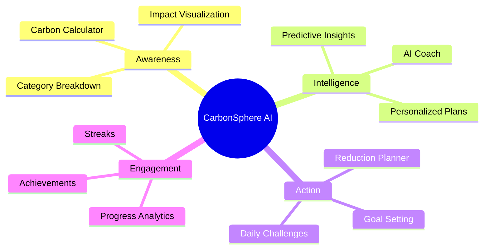
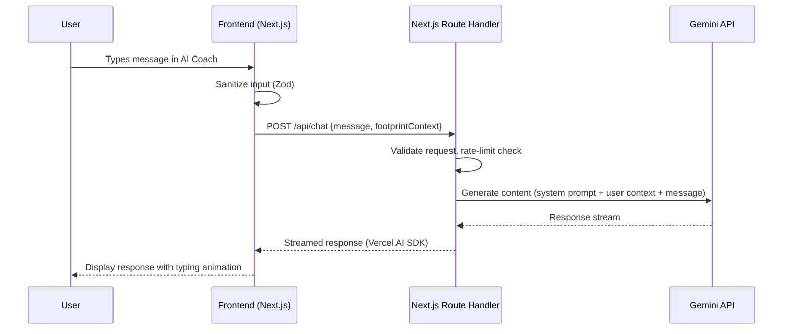
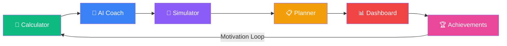

# CarbonSphere AI — Product Requirements Document

**Version:** 2.0 (Corrected)  
**Date:** June 8, 2026  
**Author:** Principal Product Manager  
**Audited By:** Principal Product Architect  
**Status:** Corrected — Aligned with TRD v1.0  
**Tagline:** *"Track Smarter. Live Greener."*

---

## Table of Contents

1. [Executive Summary](#1-executive-summary)
2. [Product Vision](#2-product-vision)
3. [Problem Statement](#3-problem-statement)
4. [Target Audience](#4-target-audience)
5. [User Personas](#5-user-personas)
6. [User Pain Points](#6-user-pain-points)
7. [User Goals](#7-user-goals)
8. [Competitive Advantages](#8-competitive-advantages)
9. [Functional Requirements](#9-functional-requirements)
10. [Non-Functional Requirements](#10-non-functional-requirements)
11. [User Roles](#11-user-roles)
12. [Detailed User Stories](#12-detailed-user-stories)
13. [Acceptance Criteria](#13-acceptance-criteria)
14. [MVP Scope](#14-mvp-scope)
15. [Future Scope](#15-future-scope)
16. [Success Metrics](#16-success-metrics)
17. [Risk Analysis](#17-risk-analysis)
18. [Accessibility Requirements](#18-accessibility-requirements)
19. [Security Requirements](#19-security-requirements)
20. [AI Features](#20-ai-features)
21. [Dashboard Requirements](#21-dashboard-requirements)
22. [Carbon Tracking Requirements](#22-carbon-tracking-requirements)
23. [Gamification Requirements](#23-gamification-requirements)
24. [Assumptions](#24-assumptions)
25. [Final Product Summary](#25-final-product-summary)

---

## 1. Executive Summary

CarbonSphere AI is an intelligent sustainability platform that empowers individuals to **calculate, understand, simulate, track, and reduce** their personal carbon footprint. By combining a robust carbon calculator with AI-powered coaching, interactive impact simulation, personalized reduction planning, and a gamified achievement system, CarbonSphere AI transforms carbon awareness from a vague concern into a measurable, actionable daily practice.

The platform is designed for a hackathon context, prioritizing **innovation, execution speed, clean architecture, production readiness, accessibility, and security**. The MVP delivers a complete end-to-end experience: from first carbon footprint calculation through personalized AI recommendations to goal tracking and achievement unlocking — all within an accessibility-first, secure web application.

### Key Deliverables

| Deliverable | Description |
|---|---|
| Carbon Footprint Calculator | Multi-category input form with real-time CO₂e estimation |
| AI Sustainability Coach | Gemini-powered conversational assistant for personalized advice |
| Carbon Impact Simulator | Interactive what-if scenarios to visualize reduction impact |
| Personalized Reduction Planner | AI-generated weekly/monthly action plans |
| Goal Tracking Dashboard | Visual progress tracking with charts and trend analysis |
| Progress Analytics | Historical data analysis with insights and comparisons |
| Achievement System | Badges, streaks, milestones, and levels for engagement |
| Accessibility-First Design | WCAG 2.1 AA compliant, fully keyboard-navigable |

### Evaluation Targets

| Criterion | Target | Strategy |
|---|---|---|
| Code Quality | ≥ 90% | Modular architecture, ESLint, Prettier, TypeScript strict mode |
| Security | ≥ 90% | Input sanitization, CSP headers, auth guards, OWASP compliance |
| Efficiency | ≥ 90% | Code splitting, lazy loading, memoization, optimized queries |
| Testing | ≥ 80% coverage | Unit, integration, E2E, accessibility, and security tests |
| Accessibility | WCAG 2.1 AA | Semantic HTML, ARIA, keyboard nav, screen reader support |

---

## 2. Product Vision

### Vision Statement

> *To make every individual a conscious contributor to climate action by transforming abstract carbon data into tangible, personalized, and rewarding daily actions.*

### Strategic Pillars



### Core Principles

1. **Simplicity Over Complexity** — Complex climate science, delivered through simple interactions.
2. **AI-Augmented, Human-Centered** — AI assists; the user decides and acts.
3. **Data-Driven Motivation** — Every action is measured, visualized, and celebrated.
4. **Privacy by Design** — User data is protected at every layer.
5. **Universal Access** — Built for everyone, regardless of ability or device.

---

## 3. Problem Statement

### The Problem

The average individual generates approximately **4.5 metric tons of CO₂e per year** (global average; ~16 tons in the US). Despite growing climate awareness, most people:

- **Cannot quantify** their personal carbon footprint.
- **Do not know** which daily actions contribute the most to emissions.
- **Lack personalized guidance** on which changes would have the most impact for *their* specific lifestyle.
- **Lose motivation** without visible progress or feedback loops.
- **Feel overwhelmed** by generic climate advice that doesn't account for their circumstances.

### The Gap

Existing carbon calculators are typically:

- One-time-use tools with no ongoing engagement.
- Generic — producing broad averages rather than personalized insights.
- Inaccessible — failing basic accessibility standards.
- Insecure — handling user data without adequate protections.
- Disconnected — offering no path from awareness to sustained action.

### The Opportunity

CarbonSphere AI bridges this gap by creating a **continuous, personalized, gamified feedback loop** that turns carbon awareness into lasting behavioral change.

---

## 4. Target Audience

### Primary Audience

| Segment | Description | Age Range | Tech Comfort |
|---|---|---|---|
| Eco-Conscious Millennials | Urban professionals aware of climate issues, seeking actionable tools | 25–40 | High |
| Gen Z Activists | Students and young professionals passionate about sustainability | 18–25 | Very High |
| Sustainability Beginners | Individuals new to carbon tracking, curious but overwhelmed | 20–55 | Medium |

### Secondary Audience

| Segment | Description |
|---|---|
| Educators | Teachers using the platform as an interactive sustainability teaching tool |
| Corporate Teams | Small teams tracking collective footprint as part of ESG initiatives |
| Parents | Families looking to model and teach sustainable behavior |

### Accessibility Audience

| Segment | Needs |
|---|---|
| Users with visual impairments | Screen reader compatibility, high contrast, resizable text |
| Users with motor disabilities | Full keyboard navigation, large click targets, no time-dependent actions |
| Users with cognitive disabilities | Simple language, progressive disclosure, clear visual hierarchy |

---

## 5. User Personas

### Persona 1 — Priya (The Conscious Professional)

| Attribute | Detail |
|---|---|
| Age | 29 |
| Occupation | Software Engineer, Bengaluru |
| Tech Comfort | High |
| Motivation | Wants to reduce her footprint but doesn't know where to start |
| Frustration | Existing tools give vague advice; no way to track progress over time |
| Goal | A 20% reduction in personal carbon footprint within 6 months |
| Accessibility | No specific needs; prefers dark mode |

> *"I recycle and take public transit, but I have no idea if that actually matters. I want numbers, not slogans."*

### Persona 2 — Marcus (The Skeptical Beginner)

| Attribute | Detail |
|---|---|
| Age | 42 |
| Occupation | Accountant, Chicago |
| Tech Comfort | Medium |
| Motivation | His daughter convinced him to try; wants proof that individual actions matter |
| Frustration | Climate dashboards are too complex; he prefers simple, bottom-line numbers |
| Goal | Understand his footprint and make 2–3 meaningful changes |
| Accessibility | Uses reading glasses; needs larger text and high contrast |

> *"Give me a bottom line. How bad am I, and what's the easiest thing I can fix?"*

### Persona 3 — Aisha (The Student Activist)

| Attribute | Detail |
|---|---|
| Age | 21 |
| Occupation | Environmental Science Student, London |
| Tech Comfort | Very High |
| Motivation | Wants data to back her advocacy; enjoys gamification and sharing achievements |
| Frustration | Most tools don't let her simulate the impact of policy-level changes |
| Goal | Achieve the lowest possible footprint and earn all badges |
| Accessibility | Uses screen reader occasionally due to low vision |

> *"I want to prove that small changes compound. And I want badges for it."*

### Persona 4 — David (The Accessibility-First User)

| Attribute | Detail |
|---|---|
| Age | 35 |
| Occupation | Freelance Writer, Toronto |
| Tech Comfort | Medium-High |
| Motivation | Cares deeply about sustainability but relies on assistive technology |
| Frustration | Most green-tech apps are not screen-reader friendly |
| Goal | Track his footprint using only keyboard and screen reader |
| Accessibility | Blind; uses NVDA screen reader; requires full keyboard navigation |

> *"I shouldn't have to see to save the planet."*

---

## 6. User Pain Points

| ID | Pain Point | Severity | Addressed By |
|---|---|---|---|
| PP-01 | Cannot quantify personal carbon footprint | Critical | Carbon Calculator |
| PP-02 | Generic advice that doesn't match lifestyle | High | AI Coach + Reduction Planner |
| PP-03 | No way to track progress over time | High | Dashboard + Analytics |
| PP-04 | Overwhelmed by too many categories and options | Medium | Progressive disclosure + AI prioritization |
| PP-05 | Lose motivation after initial use | High | Gamification + Streaks + Achievements |
| PP-06 | Don't know which changes have the biggest impact | Critical | Impact Simulator + AI recommendations |
| PP-07 | Accessibility barriers in existing tools | High | WCAG 2.1 AA compliance throughout |
| PP-08 | Privacy concerns with personal data | Medium | RLS policies + minimal data collection |
| PP-09 | No way to simulate "what if" scenarios | Medium | Carbon Impact Simulator |
| PP-10 | Complex onboarding discourages use | Medium | Guided wizard + sensible defaults |

---

## 7. User Goals

### Primary Goals

| ID | Goal | Priority |
|---|---|---|
| UG-01 | Calculate my carbon footprint quickly and accurately | P0 |
| UG-02 | Understand which categories contribute the most | P0 |
| UG-03 | Get personalized, actionable reduction recommendations | P0 |
| UG-04 | Track my progress toward reduction goals | P0 |
| UG-05 | Simulate the impact of lifestyle changes before committing | P1 |

### Secondary Goals

| ID | Goal | Priority |
|---|---|---|
| UG-06 | Earn achievements and maintain streaks for motivation | P1 |
| UG-07 | Compare my footprint to averages (national, global) | P1 |
| UG-08 | Access all features via keyboard and screen reader | P0 |
| UG-09 | Export or share my progress data | P2 |
| UG-10 | Receive weekly AI-generated sustainability tips | P1 |

---

## 8. Competitive Advantages

| Advantage | Description |
|---|---|
| **AI-First Architecture** | Gemini-powered coaching provides contextual, conversational, and personalized guidance — not static tips |
| **Impact Simulation** | Interactive what-if engine lets users preview the CO₂e impact of changes *before* committing |
| **Continuous Engagement Loop** | Calculator → Coach → Simulator → Planner → Dashboard → Achievements — a complete behavioral flywheel |
| **Accessibility Leadership** | WCAG 2.1 AA compliant from day one; designed *with* assistive technology, not retrofitted |
| **Privacy-First** | Client-side computation where possible; minimal server-side data; transparent data practices |
| **Gamification with Purpose** | Achievements tied to real environmental impact, not vanity metrics |
| **Clean Architecture** | Modular, testable, type-safe codebase built for scalability and maintainability |
| **Open Emission Factors** | Uses published, cited emission factors (EPA, DEFRA, IPCC) for credibility and transparency |

---

## 9. Functional Requirements

### FR-01: Carbon Footprint Calculator

| ID | Requirement | Priority |
|---|---|---|
| FR-01.1 | Provide a multi-step form covering 5 emission categories: Transportation, Energy, Diet, Shopping, and Waste | P0 |
| FR-01.2 | Each category must have 3–6 input fields with clear labels, units, and helper text | P0 |
| FR-01.3 | Calculate total CO₂e in real-time as the user enters data (client-side computation) | P0 |
| FR-01.4 | Display results as: total annual kg CO₂e, breakdown by category (pie/donut chart), and comparison to national/global averages | P0 |
| FR-01.5 | Support metric and imperial unit systems | P1 |
| FR-01.6 | Allow users to save their calculation results to their profile | P0 |
| FR-01.7 | Provide sensible defaults and example values for every input field | P0 |
| FR-01.8 | Validate all inputs with Zod schemas and display clear error messages (min/max ranges, required fields) | P0 |

#### Emission Categories & Input Fields

**Transportation:**

| Field | Type | Unit | Default | Range |
|---|---|---|---|---|
| Daily car commute distance | Number | km/miles | 0 | 0–500 |
| Car fuel type | Select | — | Gasoline | Gasoline, Diesel, Hybrid, Electric, None |
| Weekly public transit trips | Number | trips | 0 | 0–50 |
| Short-haul flights per year | Number | flights | 0 | 0–50 |
| Long-haul flights per year | Number | flights | 0 | 0–20 |

**Energy (Home):**

| Field | Type | Unit | Default | Range |
|---|---|---|---|---|
| Monthly electricity usage | Number | kWh | 300 | 0–5000 |
| Electricity source | Select | — | Grid Mix | Grid Mix, Partial Renewable, 100% Renewable |
| Monthly natural gas usage | Number | therms | 30 | 0–500 |
| Heating type | Select | — | Natural Gas | Natural Gas, Electric, Heat Pump, Oil, Wood, None |
| Number of household members | Number | people | 1 | 1–20 |

**Diet:**

| Field | Type | Unit | Default | Range |
|---|---|---|---|---|
| Diet type | Select | — | Omnivore | Vegan, Vegetarian, Pescatarian, Omnivore, Heavy Meat |
| Meals eaten out per week | Number | meals | 3 | 0–21 |
| Food waste percentage | Select | — | Average | Low (<10%), Average (10-30%), High (>30%) |

**Shopping & Goods:**

| Field | Type | Unit | Default | Range |
|---|---|---|---|---|
| Monthly spending on new clothing | Number | USD | 50 | 0–5000 |
| Monthly spending on electronics | Number | USD | 30 | 0–5000 |
| Monthly spending on other goods | Number | USD | 100 | 0–10000 |
| Preference for used/refurbished goods | Select | — | Sometimes | Never, Sometimes, Mostly, Always |

**Waste:**

| Field | Type | Unit | Default | Range |
|---|---|---|---|---|
| Recycling frequency | Select | — | Sometimes | Never, Sometimes, Usually, Always |
| Composting | Select | — | No | Yes, No |
| Weekly trash bags generated | Number | bags | 2 | 0–20 |

#### Emission Factors (Assumed Defaults — EPA/DEFRA Based)

| Category | Factor | Source |
|---|---|---|
| Gasoline car | 0.21 kg CO₂e/km | EPA |
| Diesel car | 0.24 kg CO₂e/km | EPA |
| Hybrid car | 0.12 kg CO₂e/km | EPA |
| Electric car | 0.05 kg CO₂e/km | EPA (grid avg) |
| Public transit (bus/rail avg) | 0.089 kg CO₂e/trip (avg 10 km) | DEFRA |
| Short-haul flight | 255 kg CO₂e/flight | DEFRA |
| Long-haul flight | 1,100 kg CO₂e/flight | DEFRA |
| Electricity (grid mix) | 0.42 kg CO₂e/kWh | EPA |
| Electricity (partial renewable) | 0.21 kg CO₂e/kWh | Assumed |
| Electricity (100% renewable) | 0.02 kg CO₂e/kWh | Assumed (lifecycle) |
| Natural gas | 5.3 kg CO₂e/therm | EPA |
| Diet — Vegan | 1,500 kg CO₂e/year | Poore & Nemecek 2018 |
| Diet — Vegetarian | 1,700 kg CO₂e/year | Poore & Nemecek 2018 |
| Diet — Pescatarian | 1,900 kg CO₂e/year | Estimated |
| Diet — Omnivore | 2,500 kg CO₂e/year | Poore & Nemecek 2018 |
| Diet — Heavy Meat | 3,300 kg CO₂e/year | Poore & Nemecek 2018 |
| Clothing spending | 0.02 kg CO₂e/USD | WRAP UK |
| Electronics spending | 0.03 kg CO₂e/USD | Estimated |
| Other goods spending | 0.015 kg CO₂e/USD | Estimated |
| Waste (landfill) | 0.5 kg CO₂e/bag/week annualized | EPA |
| Recycling offset | -15% of waste emissions | EPA |
| Composting offset | -20% of waste emissions | EPA |

> [!NOTE]
> All emission factors should be stored in a centralized configuration file (`src/lib/calculations/emissionFactors.ts`) for easy updating and auditability.

---

### FR-02: AI Sustainability Coach

| ID | Requirement | Priority |
|---|---|---|
| FR-02.1 | Provide a chat interface for users to converse with an AI sustainability coach | P0 |
| FR-02.2 | The AI coach must receive the user's carbon footprint data as context with each conversation | P0 |
| FR-02.3 | The AI must generate personalized, actionable advice based on the user's specific footprint breakdown | P0 |
| FR-02.4 | Support follow-up questions and multi-turn conversation | P0 |
| FR-02.5 | The AI must cite specific emission categories and quantify estimated savings in its recommendations | P1 |
| FR-02.6 | Provide pre-built "quick prompt" buttons for common questions (e.g., "What's my biggest impact area?", "Give me 3 easy wins", "How do I reduce transportation emissions?") | P1 |
| FR-02.7 | Display a loading indicator during AI response generation | P0 |
| FR-02.8 | Gracefully handle API errors with user-friendly messages and retry options | P0 |
| FR-02.9 | Rate-limit AI requests to prevent abuse (max 20 messages per session) | P1 |

#### AI System Prompt Specification

```
You are CarbonSphere AI Coach, a friendly and knowledgeable sustainability advisor.

CONTEXT:
- You have access to the user's carbon footprint data provided below.
- Use this data to give SPECIFIC, QUANTIFIED recommendations.
- Always reference the user's actual numbers.

GUIDELINES:
- Be encouraging, not judgmental.
- Prioritize recommendations by impact (highest CO₂e savings first).
- Provide specific numbers: "Switching from driving to public transit 3x/week could save ~X kg CO₂e/year."
- Suggest achievable, incremental changes.
- If asked about topics outside sustainability, politely redirect.
- Keep responses concise (max 200 words per response).
- Use bullet points for actionable items.

USER'S CARBON FOOTPRINT DATA:
{footprintData}
```

---

### FR-03: Carbon Impact Simulator

| ID | Requirement | Priority |
|---|---|---|
| FR-03.1 | Provide an interactive interface where users can toggle lifestyle changes and see real-time impact on their footprint | P0 |
| FR-03.2 | Display a side-by-side or before/after comparison visualization | P0 |
| FR-03.3 | Include at least 10 predefined simulation scenarios (see table below) | P0 |
| FR-03.4 | Calculate and display: absolute CO₂e saved, percentage reduction, and equivalency (e.g., "equivalent to planting X trees") | P1 |
| FR-03.5 | Allow users to combine multiple scenarios and see cumulative impact | P1 |
| FR-03.6 | Provide an "Apply to My Plan" button that converts simulated changes into reduction goals | P1 |

#### Predefined Simulation Scenarios

| ID | Scenario | Category | Estimated Annual Savings |
|---|---|---|---|
| SIM-01 | Switch to electric vehicle | Transportation | ~2,000 kg CO₂e |
| SIM-02 | Reduce car commute by 50% (WFH) | Transportation | ~1,100 kg CO₂e |
| SIM-03 | Switch from omnivore to vegetarian diet | Diet | ~800 kg CO₂e |
| SIM-04 | Switch from omnivore to vegan diet | Diet | ~1,000 kg CO₂e |
| SIM-05 | Switch to 100% renewable electricity | Energy | ~1,600 kg CO₂e |
| SIM-06 | Reduce heating by 2°C | Energy | ~400 kg CO₂e |
| SIM-07 | Eliminate 1 short-haul flight | Transportation | ~255 kg CO₂e |
| SIM-08 | Eliminate 1 long-haul flight | Transportation | ~1,100 kg CO₂e |
| SIM-09 | Start composting | Waste | ~100 kg CO₂e |
| SIM-10 | Buy 50% less new clothing | Shopping | ~120 kg CO₂e |
| SIM-11 | Always recycle | Waste | ~150 kg CO₂e |
| SIM-12 | Reduce food waste to <10% | Diet | ~200 kg CO₂e |

---

### FR-04: Personalized Reduction Planner

| ID | Requirement | Priority |
|---|---|---|
| FR-04.1 | Generate a personalized reduction plan based on the user's footprint data and selected goals | P0 |
| FR-04.2 | Plans must include specific weekly/monthly actions with estimated CO₂e savings per action | P0 |
| FR-04.3 | Allow users to set a target reduction percentage (10%, 20%, 30%, 50%) and a timeframe (3, 6, 12 months) | P0 |
| FR-04.4 | Prioritize actions by impact-to-effort ratio (easy wins first) | P1 |
| FR-04.5 | Allow users to mark actions as "accepted", "skipped", or "completed" | P1 |
| FR-04.6 | Use AI to generate the plan via the Gemini API, factoring in user preferences and constraints | P0 |
| FR-04.7 | Display plan as a checklist with progress bar | P0 |

---

### FR-05: Goal Tracking Dashboard

| ID | Requirement | Priority |
|---|---|---|
| FR-05.1 | Display total current footprint prominently (large number with unit) | P0 |
| FR-05.2 | Show footprint breakdown by category (interactive donut/pie chart) | P0 |
| FR-05.3 | Display progress toward reduction goal (progress bar or gauge) | P0 |
| FR-05.4 | Show trend line of footprint over time (line chart) | P0 |
| FR-05.5 | Display comparison to national and global averages (bar chart) | P1 |
| FR-05.6 | Show active reduction plan status and next recommended action | P1 |
| FR-05.7 | Display recent achievements and current streak | P1 |
| FR-05.8 | Support date range filtering (last 7 days, 30 days, 90 days, 1 year, all time) | P1 |
| FR-05.9 | All charts must have accessible alternatives (data tables, screen reader descriptions) | P0 |

---

### FR-06: Progress Analytics

| ID | Requirement | Priority |
|---|---|---|
| FR-06.1 | Show historical footprint data in a time-series chart | P0 |
| FR-06.2 | Calculate and display month-over-month and week-over-week changes | P1 |
| FR-06.3 | Identify the user's top 3 emission-reduction opportunities based on historical data | P1 |
| FR-06.4 | Display cumulative CO₂e saved since account creation | P0 |
| FR-06.5 | Provide equivalency visualizations (trees planted, miles not driven, gallons of gas saved) | P1 |
| FR-06.6 | Offer export functionality (CSV download of footprint history) | P2 |

---

### FR-07: Achievement System

| ID | Requirement | Priority |
|---|---|---|
| FR-07.1 | Award badges for completing specific milestones (see badge table) | P0 |
| FR-07.2 | Track and display consecutive-day streaks for logging footprint data | P1 |
| FR-07.3 | Display achievement progress (e.g., "3 of 5 badges earned") | P0 |
| FR-07.4 | Show achievement unlock notifications (toast/modal) | P1 |
| FR-07.5 | Display all available achievements with locked/unlocked state | P0 |

#### Badge Definitions

| Badge ID | Name | Icon | Criteria |
|---|---|---|---|
| B-01 | 🌱 First Step | Seedling | Complete first carbon footprint calculation |
| B-02 | 📊 Data Driven | Chart | Log footprint 3 times |
| B-03 | 🔥 On Fire | Flame | Achieve a 7-day logging streak |
| B-04 | 🎯 Goal Setter | Target | Set first reduction goal |
| B-05 | 🏆 Overachiever | Trophy | Exceed reduction goal by 10% |
| B-06 | 🌍 Planet Ally | Globe | Reduce footprint below global average |
| B-07 | 🤖 AI Explorer | Robot | Send 10 messages to the AI coach |
| B-08 | 🔬 Scientist | Microscope | Run 5 impact simulations |
| B-09 | ✅ Action Hero | Checkmark | Complete 10 actions from reduction plan |
| B-10 | 💎 Diamond Sustainer | Diamond | Maintain a 30-day streak |
| B-11 | 🚀 Carbon Crusher | Rocket | Reduce footprint by 25% from baseline |
| B-12 | 🌳 Forest Guardian | Tree | Save equivalent of 10 trees planted |

---

### FR-08: User Authentication

| ID | Requirement | Priority |
|---|---|---|
| FR-08.1 | Support email/password registration and login via Supabase Auth | P0 |
| FR-08.2 | Support Google OAuth sign-in via Supabase Auth | P0 |
| FR-08.3 | Implement session persistence (stay logged in across browser sessions) via Supabase SSR cookies | P0 |
| FR-08.4 | Provide password reset functionality via email | P1 |
| FR-08.5 | Display user profile with name, email, avatar, and join date | P1 |
| FR-08.6 | Allow guest mode for carbon calculator only (no data persistence) | P1 |

---

### FR-09: Navigation & Layout

| ID | Requirement | Priority |
|---|---|---|
| FR-09.1 | Provide a responsive sidebar navigation on desktop and bottom navigation on mobile | P0 |
| FR-09.2 | Navigation items: Dashboard, Calculator, Simulator, Planner, AI Coach, Achievements, Settings | P0 |
| FR-09.3 | Highlight current active page in navigation | P0 |
| FR-09.4 | Support dark mode and light mode with a toggle switch | P1 |
| FR-09.5 | Persist theme preference in user settings (database) and localStorage | P1 |

---

## 10. Non-Functional Requirements

### NFR-01: Performance

| ID | Requirement | Target |
|---|---|---|
| NFR-01.1 | Initial page load (Largest Contentful Paint) | < 2.5 seconds |
| NFR-01.2 | Time to Interactive | < 3.5 seconds |
| NFR-01.3 | Carbon calculation response time (client-side) | < 100ms |
| NFR-01.4 | AI coach response time | < 5 seconds (streaming preferred) |
| NFR-01.5 | Dashboard chart rendering | < 500ms |
| NFR-01.6 | Cumulative Layout Shift | < 0.1 |
| NFR-01.7 | Bundle size (gzipped) | < 300 KB initial load |

### NFR-02: Scalability

| ID | Requirement |
|---|---|
| NFR-02.1 | Architecture must support horizontal scaling via Vercel serverless functions |
| NFR-02.2 | Database design must support 100,000+ user records without degradation |
| NFR-02.3 | AI coach must handle concurrent users via request queuing |

### NFR-03: Reliability

| ID | Requirement |
|---|---|
| NFR-03.1 | Application must handle network failures gracefully (offline-capable calculator) |
| NFR-03.2 | All API calls must have timeout handling (max 15 seconds) and retry logic (max 2 retries) |
| NFR-03.3 | Data persistence must be transactional (no partial saves) |

### NFR-04: Maintainability

| ID | Requirement |
|---|---|
| NFR-04.1 | Codebase must use TypeScript in strict mode |
| NFR-04.2 | All components must have JSDoc or TSDoc comments |
| NFR-04.3 | Folder structure must follow Next.js App Router conventions with feature-based organization |
| NFR-04.4 | All configuration values must be externalized (environment variables or config files) |
| NFR-04.5 | ESLint and Prettier must be configured and enforced |

### NFR-05: Browser Support

| ID | Browser | Version |
|---|---|---|
| NFR-05.1 | Chrome | Last 2 versions |
| NFR-05.2 | Firefox | Last 2 versions |
| NFR-05.3 | Safari | Last 2 versions |
| NFR-05.4 | Edge | Last 2 versions |

---

## 11. User Roles

| Role | Permissions | Auth Required |
|---|---|---|
| **Guest** | Access carbon calculator (no data saved), view landing page | No |
| **Registered User** | All features: calculator with save, dashboard, AI coach, simulator, planner, achievements, settings | Yes |
| **Admin** (future) | User management, analytics dashboard, emission factor management | Yes (elevated) |

### Role-Based Access Matrix

| Feature | Guest | Registered User | Admin |
|---|---|---|---|
| Landing Page | ✅ | ✅ | ✅ |
| Carbon Calculator | ✅ (no save) | ✅ | ✅ |
| Save Results | ❌ | ✅ | ✅ |
| Dashboard | ❌ | ✅ | ✅ |
| AI Coach | ❌ | ✅ | ✅ |
| Impact Simulator | ❌ | ✅ | ✅ |
| Reduction Planner | ❌ | ✅ | ✅ |
| Achievements | ❌ | ✅ | ✅ |
| Settings | ❌ | ✅ | ✅ |
| Admin Panel | ❌ | ❌ | ✅ |

---

## 12. Detailed User Stories

### Epic 1: Carbon Footprint Calculation

| ID | User Story | Priority |
|---|---|---|
| US-01 | As a **guest user**, I want to **calculate my carbon footprint without creating an account**, so that I can **quickly learn my impact** before committing to sign up. | P0 |
| US-02 | As a **registered user**, I want to **complete a multi-step carbon footprint form**, so that I can **get an accurate picture of my emissions by category**. | P0 |
| US-03 | As a **registered user**, I want to **see my results as a visual breakdown** (donut chart + category list), so that I can **instantly identify my biggest emission sources**. | P0 |
| US-04 | As a **registered user**, I want to **compare my footprint to national and global averages**, so that I can **understand where I stand relative to others**. | P1 |
| US-05 | As a **registered user**, I want to **save my calculation and recalculate periodically**, so that I can **track changes over time**. | P0 |
| US-06 | As a **user**, I want to **see tooltips and helper text on every input field**, so that I can **understand what each question is asking**. | P0 |

### Epic 2: AI Sustainability Coach

| ID | User Story | Priority |
|---|---|---|
| US-07 | As a **registered user**, I want to **ask the AI coach questions about my carbon footprint**, so that I can **get personalized advice on how to reduce emissions**. | P0 |
| US-08 | As a **registered user**, I want to **see pre-built quick-prompt buttons**, so that I can **start conversations easily without typing**. | P1 |
| US-09 | As a **registered user**, I want the **AI to reference my actual footprint data in responses**, so that I can **trust the advice is relevant to me**. | P0 |
| US-10 | As a **registered user**, I want to **see a loading indicator while the AI responds**, so that I **know the system is working**. | P0 |
| US-11 | As a **registered user**, I want the **AI to handle errors gracefully**, so that I **don't see confusing error messages**. | P0 |

### Epic 3: Impact Simulation

| ID | User Story | Priority |
|---|---|---|
| US-12 | As a **registered user**, I want to **toggle predefined lifestyle changes** (e.g., switch to EV, go vegetarian), so that I can **see how each change would reduce my footprint**. | P0 |
| US-13 | As a **registered user**, I want to **see a before/after comparison chart** when I simulate changes, so that I can **visualize the impact clearly**. | P0 |
| US-14 | As a **registered user**, I want to **combine multiple simulated changes**, so that I can **see the cumulative effect**. | P1 |
| US-15 | As a **registered user**, I want to **convert a simulation into a reduction goal**, so that I can **commit to the changes I've previewed**. | P1 |

### Epic 4: Reduction Planning

| ID | User Story | Priority |
|---|---|---|
| US-16 | As a **registered user**, I want to **set a reduction target** (e.g., 20% in 6 months), so that I can **have a clear goal to work toward**. | P0 |
| US-17 | As a **registered user**, I want to **receive an AI-generated action plan** with specific weekly tasks, so that I can **follow a structured path to my goal**. | P0 |
| US-18 | As a **registered user**, I want to **mark plan items as completed or skipped**, so that I can **track my adherence**. | P1 |
| US-19 | As a **registered user**, I want to **see a progress bar on my reduction plan**, so that I can **know how far I am from my goal**. | P0 |

### Epic 5: Dashboard & Analytics

| ID | User Story | Priority |
|---|---|---|
| US-20 | As a **registered user**, I want to **see my current footprint, trend, and goal progress on a single dashboard**, so that I can **get a quick snapshot of my status**. | P0 |
| US-21 | As a **registered user**, I want to **view my footprint history in a time-series chart**, so that I can **see long-term trends**. | P0 |
| US-22 | As a **registered user**, I want to **see equivalency metrics** (trees, miles, gallons), so that I can **understand my impact in relatable terms**. | P1 |
| US-23 | As a **registered user**, I want to **filter analytics by date range**, so that I can **focus on specific periods**. | P1 |

### Epic 6: Gamification & Achievements

| ID | User Story | Priority |
|---|---|---|
| US-24 | As a **registered user**, I want to **earn badges when I reach milestones**, so that I feel **recognized and motivated**. | P0 |
| US-25 | As a **registered user**, I want to **see my streak counter** for consecutive days of engagement, so that I **maintain momentum**. | P1 |
| US-26 | As a **registered user**, I want to **see a notification when I unlock a new badge**, so that the **achievement feels rewarding**. | P1 |
| US-27 | As a **registered user**, I want to **view all available badges** (locked and unlocked), so that I can **set personal targets**. | P0 |

### Epic 7: Accessibility

| ID | User Story | Priority |
|---|---|---|
| US-28 | As a **user with visual impairments**, I want to **navigate the entire application using only a keyboard**, so that I **don't need a mouse**. | P0 |
| US-29 | As a **user with visual impairments**, I want **all charts to have accessible data table alternatives**, so that I can **understand the data via screen reader**. | P0 |
| US-30 | As a **user with visual impairments**, I want **all images and icons to have descriptive alt text**, so that my **screen reader can describe them**. | P0 |
| US-31 | As a **user with cognitive disabilities**, I want **clear, simple language and progressive disclosure**, so that I'm **not overwhelmed by information**. | P0 |
| US-32 | As a **user**, I want to **toggle between light and dark mode**, so that I can **choose the visual theme that's most comfortable**. | P1 |

### Epic 8: Authentication & Settings

| ID | User Story | Priority |
|---|---|---|
| US-33 | As a **new user**, I want to **register with email/password or Google**, so that I can **save my data and access all features**. | P0 |
| US-34 | As a **returning user**, I want to **log in and see my data persisted**, so that I **don't have to re-enter information**. | P0 |
| US-35 | As a **registered user**, I want to **choose my preferred unit system** (metric/imperial), so that inputs are in **units I understand**. | P1 |
| US-36 | As a **registered user**, I want to **delete my account and all associated data**, so that I **maintain control over my information**. | P1 |

---

## 13. Acceptance Criteria

### AC for US-02 (Multi-step Carbon Footprint Form)

```gherkin
Feature: Carbon Footprint Calculator

  Scenario: Complete multi-step form
    Given I am a registered user on the Calculator page
    When I fill in all required fields across all 5 categories
    And I click "Calculate My Footprint"
    Then I should see my total annual CO₂e in kilograms
    And I should see a donut chart showing breakdown by category
    And I should see my footprint compared to national and global averages
    And the results should be saved to my profile

  Scenario: Validation errors
    Given I am on the Calculator page
    When I leave a required field empty and try to proceed
    Then I should see an inline error message below the field
    And the error message should be announced by screen readers (aria-live)
    And the focus should move to the first invalid field

  Scenario: Real-time calculation
    Given I am filling in the Calculator form
    When I change any input value
    Then the running total CO₂e estimate should update within 100ms
    And the update should not cause page layout shifts
```

### AC for US-07 (AI Sustainability Coach)

```gherkin
Feature: AI Sustainability Coach

  Scenario: Ask a question
    Given I am a registered user on the AI Coach page
    And I have a saved carbon footprint
    When I type "What's my biggest impact area?" and press Send
    Then I should see a loading indicator
    And within 5 seconds I should see a response
    And the response should reference my actual footprint data
    And the response should include at least one specific, quantified recommendation

  Scenario: Quick prompts
    Given I am on the AI Coach page
    When I click a quick-prompt button
    Then the prompt text should appear in the chat input
    And the message should be sent automatically
    And I should receive a contextual response

  Scenario: Error handling
    Given the AI API returns an error
    When I send a message
    Then I should see a friendly error message ("Something went wrong. Please try again.")
    And I should see a "Retry" button
    And the error should be logged to the console
```

### AC for US-12 (Impact Simulation)

```gherkin
Feature: Carbon Impact Simulator

  Scenario: Toggle a simulation scenario
    Given I am on the Simulator page with a saved footprint
    When I toggle "Switch to electric vehicle" ON
    Then I should see my projected new footprint (lower number)
    And I should see the CO₂e savings highlighted
    And I should see a before/after comparison chart
    And the chart should have an accessible data table alternative

  Scenario: Combine multiple scenarios
    Given I have toggled "Switch to EV" and "Go vegetarian"
    Then I should see the combined savings
    And the total should not double-count overlapping categories
```

### AC for US-20 (Dashboard)

```gherkin
Feature: Goal Tracking Dashboard

  Scenario: View dashboard
    Given I am a registered user with saved footprint data
    When I navigate to the Dashboard
    Then I should see my current total footprint prominently displayed
    And I should see a category breakdown chart
    And I should see my goal progress (if a goal is set)
    And I should see a trend line chart
    And I should see my recent achievements
    And all charts should be keyboard-navigable
    And all charts should have screen-reader-accessible alternatives
```

### AC for US-24 (Earn Badges)

```gherkin
Feature: Achievement System

  Scenario: First calculation badge
    Given I have never calculated my footprint
    When I complete my first calculation and save it
    Then I should see a toast notification: "🌱 Achievement Unlocked: First Step!"
    And the badge should appear as unlocked on my Achievements page
    And the notification should be announced by screen readers

  Scenario: View achievements
    Given I navigate to the Achievements page
    Then I should see all 12 badges displayed
    And earned badges should have full color and a checkmark
    And unearned badges should be grayed out with progress indicators
    And each badge should have descriptive alt text
```

---

## 14. MVP Scope

### In Scope (MVP — Hackathon Deliverable)

| Feature | Scope |
|---|---|
| **Carbon Calculator** | All 5 categories, real-time calculation, results visualization, save to profile |
| **AI Coach** | Chat interface, personalized responses using Gemini API, quick prompts, error handling |
| **Impact Simulator** | 12 predefined scenarios, toggle interface, before/after chart, cumulative mode |
| **Reduction Planner** | AI-generated plan, target setting (percentage + timeframe), action checklist with progress bar |
| **Dashboard** | Total footprint, category breakdown chart, goal progress, trend line, average comparisons |
| **Progress Analytics** | Historical chart, cumulative savings, equivalency metrics |
| **Achievements** | 12 badges, streak tracking, unlock notifications, achievements page |
| **Auth** | Email/password registration and login + Google OAuth via Supabase Auth |
| **Accessibility** | WCAG 2.1 AA compliance, keyboard navigation, screen reader support, dark/light mode |
| **Security** | Input sanitization via Zod, Supabase RLS policies, CSP headers, environment variable management |
| **Testing** | Vitest unit tests (≥80% coverage), React Testing Library integration tests, Playwright E2E tests, axe-core accessibility tests |

### Out of Scope (MVP)

| Feature | Rationale |
|---|---|
| Social sharing | Not core to carbon tracking; adds complexity |
| Team/organization features | Individual focus for MVP |
| Mobile native apps | Responsive web app is sufficient |
| Real-time data integrations (smart meters, EV APIs) | Requires third-party partnerships |
| Multi-language support | English-only for MVP |
| Admin panel | No admin users in MVP |
| Offline mode (PWA) | Adds complexity; online-only for MVP |
| CSV export | Low priority; can be added post-MVP |

---

## 15. Future Scope

### Phase 2 (Post-Hackathon, 1–3 Months)

| Feature | Description |
|---|---|
| Magic Link authentication | Passwordless login via Supabase Auth |
| PWA & offline mode | Enable offline calculator and data caching |
| Social sharing | Share achievements and footprint comparisons on social media |
| Weekly email digests | AI-generated weekly sustainability tips via email |
| CSV/PDF export | Download footprint history and reduction plans |
| Multi-language (i18n) | Support for Spanish, French, Hindi, Mandarin |

### Phase 3 (3–6 Months)

| Feature | Description |
|---|---|
| Team/Organization mode | Collective carbon tracking for companies and schools |
| Smart device integrations | Connect to smart home devices, utility APIs, EV chargers |
| Community features | Leaderboards, challenges, forums |
| Admin dashboard | Analytics, user management, emission factor updates |
| Carbon offset marketplace | Partner with verified offset providers |

### Phase 4 (6–12 Months)

| Feature | Description |
|---|---|
| Mobile native apps | iOS and Android apps via React Native |
| Advanced AI | Predictive modeling, anomaly detection, trend forecasting |
| API platform | Public API for third-party integrations |
| Enterprise ESG reporting | Corporate sustainability reporting features |

---

## 16. Success Metrics

### Hackathon Evaluation Metrics

| Metric | Target | Measurement |
|---|---|---|
| Code Quality Score | ≥ 90% | ESLint zero errors, TypeScript strict mode, consistent code style, modular architecture |
| Security Score | ≥ 90% | OWASP top 10 addressed, input sanitization, auth guards, CSP headers, no exposed secrets |
| Efficiency Score | ≥ 90% | Lighthouse performance ≥ 90, bundle size < 300KB, LCP < 2.5s |
| Testing Score | ≥ 80% coverage | Vitest unit tests, React Testing Library integration tests, Playwright E2E tests, axe-core accessibility tests |
| Accessibility Score | WCAG 2.1 AA | Lighthouse accessibility ≥ 95, manual screen reader testing, keyboard navigation audit |

### Product Success Metrics (Post-Launch)

| Metric | Target | Timeframe |
|---|---|---|
| User Registration | 500 users | First 30 days |
| Calculator Completion Rate | ≥ 70% | Ongoing |
| AI Coach Engagement | ≥ 3 messages per session average | Ongoing |
| Reduction Plan Adoption | ≥ 40% of users create a plan | First 60 days |
| 7-Day Retention | ≥ 30% | Ongoing |
| 30-Day Retention | ≥ 15% | Ongoing |
| Achievement Unlock Rate | ≥ 50% users unlock 3+ badges | First 90 days |
| NPS Score | ≥ 40 | Quarterly |

---

## 17. Risk Analysis

| ID | Risk | Probability | Impact | Mitigation |
|---|---|---|---|---|
| R-01 | Gemini API rate limits or downtime | Medium | High | Implement caching, retry logic, and graceful fallback messages; queue requests during high load |
| R-02 | Inaccurate emission factors | Medium | High | Use published, cited sources (EPA, DEFRA); clearly label estimates; allow admin updates |
| R-03 | Users provide unrealistic input values | Medium | Medium | Input validation with Zod schemas (min/max ranges); outlier detection with warnings |
| R-04 | AI generates incorrect or harmful advice | Low | High | System prompt guardrails; restrict topics to sustainability; add disclaimer text |
| R-05 | Supabase/Vercel costs exceed budget | Low | Medium | Implement query optimization; use client-side calculations where possible; set billing alerts |
| R-06 | Accessibility regressions during development | Medium | High | Automated axe-core tests in CI; manual screen reader testing before each release |
| R-07 | Large bundle size slows load times | Medium | Medium | Code splitting, lazy loading, tree shaking; monitor bundle size in CI |
| R-08 | Data breach or unauthorized access | Low | Critical | Supabase RLS policies; input sanitization via Zod; regular security audits; no PII in client logs |
| R-09 | Scope creep during hackathon | High | High | Strict MVP scope; feature freeze after initial build; focus on polish over new features |
| R-10 | Poor mobile experience | Medium | Medium | Mobile-first responsive design; test on real devices; use responsive breakpoints |

---

## 18. Accessibility Requirements

### WCAG 2.1 AA Compliance

| Principle | Requirements |
|---|---|
| **Perceivable** | All non-text content has text alternatives; color is not the sole means of conveying information; text has minimum 4.5:1 contrast ratio (3:1 for large text); content is resizable to 200% without loss of functionality |
| **Operable** | All functionality is keyboard accessible; no keyboard traps; skip navigation links provided; focus indicators are visible; no content flashes more than 3 times per second |
| **Understandable** | Language of page is programmatically set; input fields have visible labels; error messages are descriptive and suggest corrections; navigation is consistent across pages |
| **Robust** | Valid HTML5; ARIA landmarks and roles used correctly; content compatible with screen readers (NVDA, JAWS, VoiceOver) |

### Specific Implementation Requirements

| ID | Requirement | Priority |
|---|---|---|
| A11Y-01 | All pages must have a single `<h1>` and proper heading hierarchy (`h1` → `h2` → `h3`) | P0 |
| A11Y-02 | All form inputs must have associated `<label>` elements (not just placeholder text) | P0 |
| A11Y-03 | All interactive elements must have visible focus indicators (min 2px outline) | P0 |
| A11Y-04 | All images must have descriptive `alt` attributes | P0 |
| A11Y-05 | All charts must have an accessible data table alternative (visually hidden but screen-reader-accessible) | P0 |
| A11Y-06 | Navigation must include a "Skip to main content" link as the first focusable element | P0 |
| A11Y-07 | Dynamic content updates must use `aria-live` regions (polite for non-critical, assertive for errors) | P0 |
| A11Y-08 | Color contrast must meet WCAG AA standards: 4.5:1 for normal text, 3:1 for large text | P0 |
| A11Y-09 | The application must be fully usable at 200% zoom without horizontal scrolling | P0 |
| A11Y-10 | ARIA roles, states, and properties must be used correctly on custom components | P0 |
| A11Y-11 | Tab order must follow visual reading order (left-to-right, top-to-bottom) | P0 |
| A11Y-12 | Modal dialogs must trap focus and return focus to the trigger element on close | P0 |
| A11Y-13 | Toast notifications must be announced via `aria-live="polite"` | P1 |
| A11Y-14 | The theme toggle must have an accessible label describing current state | P0 |

### Testing Requirements

| Test Type | Tool | Frequency |
|---|---|---|
| Automated accessibility audit | axe-core (integrated into Playwright) | Every component, CI pipeline |
| Color contrast check | axe-core / Lighthouse | Every component |
| Keyboard navigation audit | Manual | Every page, before release |
| Screen reader testing | NVDA (Windows) | All critical flows, before release |
| Lighthouse accessibility score | Lighthouse | CI pipeline, target ≥ 95 |

---

## 19. Security Requirements

### Authentication & Authorization

| ID | Requirement | Priority |
|---|---|---|
| SEC-01 | Use Supabase Auth for all authentication flows | P0 |
| SEC-02 | Enforce strong password policy: minimum 8 characters, 1 uppercase, 1 lowercase, 1 number | P0 |
| SEC-03 | Implement auth state guards on all protected routes via Next.js middleware (redirect to login if unauthenticated) | P0 |
| SEC-04 | Store Supabase config (`NEXT_PUBLIC_SUPABASE_URL`, `NEXT_PUBLIC_SUPABASE_ANON_KEY`) in environment variables, never in source code | P0 |
| SEC-05 | Implement session management via Supabase SSR cookies with auto-refresh | P1 |

### Data Protection

| ID | Requirement | Priority |
|---|---|---|
| SEC-06 | All data in transit must use HTTPS/TLS | P0 |
| SEC-07 | Supabase Row Level Security (RLS) policies must enforce user-level data isolation (users can only read/write their own data) | P0 |
| SEC-08 | No PII (passwords, tokens) stored in client-side storage (localStorage/sessionStorage) | P0 |
| SEC-09 | API keys for Gemini must be server-side only (stored in Vercel environment variables, accessed only via Next.js Route Handlers) | P0 |
| SEC-10 | Implement rate limiting on AI coach API calls (max 20 per hour per user, enforced via Upstash Redis in middleware) | P1 |

### Input Security

| ID | Requirement | Priority |
|---|---|---|
| SEC-11 | Sanitize all user inputs via Zod validation schemas before processing or storing (prevent XSS) | P0 |
| SEC-12 | Validate all numeric inputs against defined min/max ranges via Zod | P0 |
| SEC-13 | Sanitize AI coach chat input (strip HTML/script tags) | P0 |
| SEC-14 | Implement Content Security Policy (CSP) headers via Next.js middleware | P0 |

### Supabase RLS Policies

```sql
-- Enable RLS on all tables
ALTER TABLE users ENABLE ROW LEVEL SECURITY;
ALTER TABLE user_settings ENABLE ROW LEVEL SECURITY;
ALTER TABLE footprints ENABLE ROW LEVEL SECURITY;
ALTER TABLE reduction_plans ENABLE ROW LEVEL SECURITY;
ALTER TABLE plan_actions ENABLE ROW LEVEL SECURITY;
ALTER TABLE user_achievements ENABLE ROW LEVEL SECURITY;
ALTER TABLE ai_conversations ENABLE ROW LEVEL SECURITY;
ALTER TABLE ai_messages ENABLE ROW LEVEL SECURITY;

-- Users can only manage their own profile
CREATE POLICY "Users can manage their own profile"
ON users FOR ALL
USING (auth.uid() = id);

-- Users can only manage their own data
CREATE POLICY "Users can manage own settings" ON user_settings FOR ALL USING (auth.uid() = user_id);
CREATE POLICY "Users can manage own footprints" ON footprints FOR ALL USING (auth.uid() = user_id);
CREATE POLICY "Users can manage own plans" ON reduction_plans FOR ALL USING (auth.uid() = user_id);
CREATE POLICY "Users can manage own achievements" ON user_achievements FOR ALL USING (auth.uid() = user_id);
CREATE POLICY "Users can manage own conversations" ON ai_conversations FOR ALL USING (auth.uid() = user_id);

-- Relational policies for child tables
CREATE POLICY "Users can manage own plan actions"
ON plan_actions FOR ALL
USING (
  EXISTS (
    SELECT 1 FROM reduction_plans rp
    WHERE rp.id = plan_actions.plan_id AND rp.user_id = auth.uid()
  )
);

CREATE POLICY "Users can manage own AI messages"
ON ai_messages FOR ALL
USING (
  EXISTS (
    SELECT 1 FROM ai_conversations ac
    WHERE ac.id = ai_messages.conversation_id AND ac.user_id = auth.uid()
  )
);
```

### Security Testing

| Test Type | Tool | Frequency |
|---|---|---|
| Dependency vulnerability scan | `pnpm audit` | Every build, CI pipeline |
| Static analysis (secrets detection) | ESLint plugin, git-secrets | Pre-commit hook |
| CSP header validation | Lighthouse / securityheaders.com | Before release |
| RLS policy testing | Supabase local development | Before deployment |
| XSS testing | Manual + automated (OWASP ZAP) | Before release |

---

## 20. AI Features

### Architecture



### AI Feature Specifications

| Feature | Model | Input | Output |
|---|---|---|---|
| **Sustainability Coach** | Gemini 2.0 Flash | User message + footprint data + conversation history | Personalized sustainability advice (max 200 words) |
| **Reduction Plan Generator** | Gemini 2.0 Flash | Footprint data + target percentage + timeframe + constraints | Structured JSON action plan with weekly tasks |
| **Insight Generator** | Gemini 2.0 Flash | Footprint history + trend data | 3–5 bullet-point insights about user's progress |

### AI Prompt Templates

#### Reduction Plan Generation Prompt

```
Generate a personalized carbon reduction plan.

USER'S CURRENT FOOTPRINT:
{footprintData}

TARGET: Reduce by {targetPercentage}% within {timeframeMonths} months.

REQUIREMENTS:
1. Return a JSON object with the following structure:
{
  "planName": "string",
  "targetReduction": number (kg CO₂e),
  "timeframeWeeks": number,
  "actions": [
    {
      "id": "string",
      "title": "string",
      "description": "string",
      "category": "transportation|energy|diet|shopping|waste",
      "estimatedSavings": number (kg CO₂e/year),
      "difficulty": "easy|medium|hard",
      "weekToStart": number
    }
  ]
}
2. Prioritize actions by impact-to-effort ratio (easy wins first).
3. Include 8-12 actions.
4. Ensure total estimated savings meet or exceed the target.
5. Base all recommendations on the user's actual footprint data.
```

### AI Safety & Guardrails

| Guardrail | Implementation |
|---|---|
| Topic restriction | System prompt instructs AI to only discuss sustainability topics |
| Response length limit | Max 200 words per response enforced in system prompt |
| No personal data leakage | AI never repeats raw user data; only references aggregated categories |
| Disclaimer | "AI-generated advice. Emission estimates are approximate." displayed under every response |
| Harmful content filter | Gemini's built-in safety filters enabled at default thresholds |
| Rate limiting | 20 messages per hour per user, enforced server-side via Upstash Redis |

---

## 21. Dashboard Requirements

### Layout Specification

```
┌─────────────────────────────────────────────────────────┐
│  Header: "Your Carbon Dashboard"           [Date Filter]│
├──────────────┬──────────────┬───────────────────────────┤
│              │              │                           │
│  Total       │  Reduction   │   Category Breakdown      │
│  Footprint   │  Goal        │   (Donut Chart)           │
│  (Big #)     │  Progress    │                           │
│              │  (Gauge)     │                           │
├──────────────┴──────────────┴───────────────────────────┤
│                                                         │
│  Footprint Trend Over Time (Line Chart)                 │
│                                                         │
├─────────────────────────────┬───────────────────────────┤
│                             │                           │
│  Average Comparison         │   Equivalency Metrics     │
│  (Bar Chart)                │   🌳 Trees │ 🚗 Miles    │
│  You vs National vs Global  │   ⛽ Gallons saved        │
│                             │                           │
├─────────────────────────────┴───────────────────────────┤
│                                                         │
│  Recent Achievements          │  Active Plan Status     │
│  [Badge] [Badge] [Badge]      │  Next Action: ...       │
│                                                         │
└─────────────────────────────────────────────────────────┘
```

### Dashboard Components

| Component | Chart Type | Data Source | Accessibility |
|---|---|---|---|
| Total Footprint | Large number display | Latest footprint record | `aria-label` with full context |
| Category Breakdown | Interactive donut chart | Latest footprint breakdown | Hidden data table, `aria-describedby` |
| Goal Progress | Circular gauge / progress bar | User's reduction goal vs current | `role="progressbar"`, `aria-valuenow` |
| Trend Line | Line chart (time series) | All historical footprint records | Hidden data table, keyboard-navigable points |
| Average Comparison | Grouped bar chart | User + national + global constants | Hidden data table |
| Equivalencies | Icon + number cards | Computed from total savings | `aria-label` with descriptive text |
| Recent Achievements | Badge icons with labels | User's achievement records | `alt` text on each badge image |
| Plan Status | Card with text + progress bar | Active reduction plan | Semantic HTML with `role="status"` |

### Chart Library

**Recharts** (React-based) — chosen for:

- Built on SVG (inherently more accessible than Canvas)
- Good React integration
- Lightweight (~45KB gzipped)
- Supports responsive containers
- Easy to add custom accessibility enhancements

> [!IMPORTANT]
> Every chart MUST have a companion `<table>` with `class="sr-only"` that contains the same data in tabular format for screen readers.

---

## 22. Carbon Tracking Requirements

### Data Model

The carbon tracking data model aligns with the Prisma schema defined in the TRD and DB Schema Document. Footprint category inputs are stored as JSONB columns for flexible iteration, while the computed `totalCo2e` is a strongly-typed float column for efficient querying.

```typescript
// Corresponds to Prisma Footprint model + JSONB column types
interface FootprintRecord {
  id: string;                    // Auto-generated UUID
  userId: string;                // Supabase Auth UID
  createdAt: Date;               // Server timestamp

  // Input Data (stored as JSONB columns)
  transportation: {
    carCommuteKm: number;
    carFuelType: 'gasoline' | 'diesel' | 'hybrid' | 'electric' | 'none';
    publicTransitTrips: number;
    shortHaulFlights: number;
    longHaulFlights: number;
  };

  energy: {
    electricityKwh: number;
    electricitySource: 'grid_mix' | 'partial_renewable' | 'full_renewable';
    naturalGasTherms: number;
    heatingType: 'natural_gas' | 'electric' | 'heat_pump' | 'oil' | 'wood' | 'none';
    householdMembers: number;
  };

  diet: {
    dietType: 'vegan' | 'vegetarian' | 'pescatarian' | 'omnivore' | 'heavy_meat';
    mealsOutPerWeek: number;
    foodWaste: 'low' | 'average' | 'high';
  };

  shopping: {
    clothingSpend: number;       // Monthly USD
    electronicsSpend: number;    // Monthly USD
    otherGoodsSpend: number;     // Monthly USD
    usedGoodsPreference: 'never' | 'sometimes' | 'mostly' | 'always';
  };

  waste: {
    recyclingFrequency: 'never' | 'sometimes' | 'usually' | 'always';
    composting: boolean;
    weeklyTrashBags: number;
  };

  // Computed Result (stored as typed column)
  totalCo2e: number;             // Total annual kg CO₂e
}
```

### Calculation Engine Requirements

| ID | Requirement |
|---|---|
| CT-01 | All calculations must be performed client-side in a pure function (`calculateFootprint(inputs) => results`) |
| CT-02 | The calculation function must be deterministic (same inputs → same outputs) |
| CT-03 | The calculation function must be unit-tested with at least 20 test cases covering edge cases (using Vitest) |
| CT-04 | Emission factors must be imported from a centralized config file, not hardcoded in the calculator |
| CT-05 | Results must be rounded to the nearest whole kilogram |
| CT-06 | Energy emissions must be divided by `householdMembers` to represent per-capita contribution |
| CT-07 | Shopping emissions for "used goods" preference must apply a discount multiplier: never=1.0, sometimes=0.85, mostly=0.6, always=0.4 |
| CT-08 | Waste emissions must apply recycling offset (-15%) and composting offset (-20%) when applicable |

### Tracking & History

| ID | Requirement |
|---|---|
| CT-09 | Each saved calculation creates a new `Footprint` row in PostgreSQL (via Prisma Server Action) |
| CT-10 | Users can view a list of all their past calculations sorted by date |
| CT-11 | The dashboard trend line uses the `totalCo2e` from each record plotted against `createdAt` |
| CT-12 | The system stores a maximum of 100 records per user (oldest records archived via application logic) |
| CT-13 | Users can delete individual records (with confirmation dialog) |

---

## 23. Gamification Requirements

### Achievement Engine

```typescript
interface Achievement {
  id: string;              // e.g., "B-01"
  name: string;            // e.g., "First Step"
  description: string;     // e.g., "Complete your first carbon footprint calculation"
  icon: string;            // Emoji or icon identifier
  criteria: AchievementCriteria;
  unlockedAt?: Date;       // null if locked
  progress?: number;       // 0-100 for progressive achievements
}

interface AchievementCriteria {
  type: 'event' | 'count' | 'threshold' | 'streak';
  event?: string;          // e.g., "footprint_calculated"
  count?: number;          // e.g., 3 (for "log 3 times")
  threshold?: number;      // e.g., 25 (for "reduce by 25%")
  streakDays?: number;     // e.g., 7 (for "7-day streak")
}
```

### Achievement Check Logic

| Trigger Event | Achievements Evaluated |
|---|---|
| Footprint saved | B-01 (First Step), B-02 (Data Driven), B-06 (Planet Ally), B-11 (Carbon Crusher) |
| AI coach message sent | B-07 (AI Explorer) |
| Simulation run | B-08 (Scientist) |
| Plan action completed | B-09 (Action Hero) |
| Goal exceeded | B-05 (Overachiever) |
| Streak updated | B-03 (On Fire), B-10 (Diamond Sustainer) |
| Goal set | B-04 (Goal Setter) |
| Cumulative savings calculated | B-12 (Forest Guardian) |

### Streak System

| Rule | Implementation |
|---|---|
| Streak increments | User logs/interacts with the platform (any tracked action) on consecutive calendar days |
| Streak resets | If a full calendar day passes with no tracked action |
| Streak display | Current streak count + flame emoji + best streak record |
| Streak notifications | "🔥 7-day streak! You earned the On Fire badge!" |
| Grace period | None for MVP (strict daily tracking) |

### Notification System

| Event | Notification Type | Content |
|---|---|---|
| Badge unlocked | Toast (bottom-right) + sound | "🏆 Achievement Unlocked: {badge name}" |
| Streak milestone | Toast | "🔥 {N}-day streak! Keep going!" |
| Goal progress | Dashboard banner | "You're {X}% toward your goal!" |

> [!NOTE]
> All notifications must use `aria-live="polite"` to be announced by screen readers without interrupting current focus.

---

## 24. Assumptions

### Technical Assumptions

| ID | Assumption | Rationale |
|---|---|---|
| TA-01 | **Supabase** (Auth + PostgreSQL) with **Prisma ORM** is used as the backend | Rapid development, built-in auth, relational database with RLS, type-safe ORM |
| TA-02 | **Next.js 15** (App Router) with React 19 and TypeScript is the frontend framework | Server Components for performance, Server Actions for type-safe mutations, file-based routing |
| TA-03 | **Next.js 15** is the framework and build system (no separate build tool needed) | Built-in bundling, code splitting, and optimization via Turbopack |
| TA-04 | **Gemini 2.0 Flash** is the AI model | Fast inference, low cost, good quality for conversational AI |
| TA-05 | **Recharts** is used for data visualization | React-native, SVG-based, accessible, lightweight |
| TA-06 | The application is deployed as a **server-rendered application** on **Vercel** | Edge network, serverless functions, preview deployments, zero-config |
| TA-07 | AI API calls are proxied through **Next.js Route Handlers** (deployed on Vercel) | Keeps API keys server-side, enables rate limiting via Upstash Redis |
| TA-08 | All emission factors are approximate and based on published sources | Noted in UI with citation links |

### Product Assumptions

| ID | Assumption | Rationale |
|---|---|---|
| PA-01 | Users will calculate their footprint at least monthly | Enables meaningful trend tracking |
| PA-02 | Gamification significantly improves retention | Supported by behavioral science research |
| PA-03 | Users prefer actionable specificity over generic advice | Validated by persona research |
| PA-04 | English-only is sufficient for MVP | Hackathon scope constraint |
| PA-05 | Users trust AI-generated advice when it references their own data | Personalization builds credibility |
| PA-06 | A single currency (USD) is sufficient for MVP shopping calculations | Can be extended later |
| PA-07 | Users will self-report data honestly | No verification mechanism in MVP |

### Constraints

| Constraint | Impact |
|---|---|
| Hackathon time limit | Must prioritize MVP features; no gold-plating |
| Supabase free tier limits | 500 MB database, 50,000 monthly active users — sufficient for demo/evaluation |
| Gemini API rate limits | May need request queuing; implement caching for repeated queries |
| Single developer/small team | Feature-based architecture enables parallel work |

---

## 25. Final Product Summary

### CarbonSphere AI — "Track Smarter. Live Greener."

CarbonSphere AI is a **complete, production-ready, accessibility-first sustainability platform** that transforms individual carbon awareness into measurable action through six interconnected modules:



### The User Journey

1. **Calculate** — Complete a 5-category carbon footprint assessment with real-time results.
2. **Understand** — Chat with an AI coach that knows your specific numbers and gives tailored advice.
3. **Simulate** — Explore "what if" scenarios to preview the impact of lifestyle changes.
4. **Plan** — Receive an AI-generated, prioritized action plan with weekly milestones.
5. **Track** — Monitor progress on a beautiful, accessible dashboard with charts and comparisons.
6. **Celebrate** — Earn badges, maintain streaks, and see your cumulative impact grow.

### Technical Excellence

| Area | Implementation |
|---|---|
| **Architecture** | Next.js 15 + TypeScript + Tailwind CSS, feature-based folder structure, Supabase backend |
| **Code Quality** | ESLint, Prettier, TypeScript strict mode, comprehensive JSDoc |
| **Security** | Supabase Auth, PostgreSQL RLS policies, CSP headers, input sanitization via Zod, server-side API keys |
| **Testing** | Vitest + React Testing Library + Playwright (≥80% coverage), axe-core accessibility tests |
| **Accessibility** | WCAG 2.1 AA, keyboard navigation, screen reader support, high contrast, skip navigation |
| **Performance** | React Server Components, code splitting, lazy loading, memoization, SVG charts, next/image optimization |

### Technology Stack

| Layer | Technology |
|---|---|
| Framework | Next.js 15 (App Router) + TypeScript |
| Styling | Tailwind CSS + shadcn/ui |
| State Management | Zustand + React Server Components |
| Routing | Next.js App Router (file-system based) |
| Charts | Recharts |
| Backend | Supabase (Auth + PostgreSQL) + Next.js Server Actions / Route Handlers |
| ORM | Prisma |
| AI | Google Gemini 2.0 Flash (via Next.js Route Handlers on Vercel) |
| Validation | Zod |
| Testing | Vitest + React Testing Library + Playwright + axe-core |
| CI/CD | Vercel (with GitHub Actions for lint/test) |
| Deployment | Vercel |
| Linting | ESLint + Prettier |

### Folder Structure

```
src/
├── app/                      # Next.js App Router
│   ├── (auth)/               # Auth routes (login, register)
│   │   ├── login/
│   │   └── register/
│   ├── (dashboard)/          # Dashboard layout & authenticated routes
│   │   ├── dashboard/
│   │   ├── calculator/
│   │   ├── coach/
│   │   ├── simulator/
│   │   ├── planner/
│   │   ├── analytics/
│   │   ├── achievements/
│   │   └── settings/
│   ├── api/                  # Route Handlers (AI streaming)
│   │   └── chat/
│   ├── layout.tsx
│   └── page.tsx              # Landing page
├── components/               # React Components
│   ├── ui/                   # shadcn/ui generic components
│   ├── calculator/           # Calculator domain components
│   ├── charts/               # Recharts wrappers with a11y
│   └── chat/                 # AI chat components
├── lib/                      # Core Logic & Utilities
│   ├── ai/                   # Gemini configurations
│   ├── calculations/         # Pure carbon calculation logic + emission factors
│   ├── prisma.ts             # Prisma singleton client
│   ├── supabase/             # Supabase SSR clients (server + client)
│   └── utils.ts              # Tailwind merge (cn), formatting helpers
├── schemas/                  # Zod validation schemas (shared between client + server)
├── server/                   # Backend Logic
│   └── actions/              # Next.js Server Actions
├── store/                    # Zustand stores
├── styles/                   # globals.css
└── types/                    # TypeScript interfaces
prisma/
└── schema.prisma             # Database Schema Definition
```

### Delivery Checklist

- [ ] Carbon Footprint Calculator with 5 categories and real-time results
- [ ] AI Sustainability Coach with personalized, context-aware responses
- [ ] Carbon Impact Simulator with 12 scenarios and cumulative mode
- [ ] Personalized Reduction Planner with AI-generated action plans
- [ ] Goal Tracking Dashboard with 6 visualization components
- [ ] Progress Analytics with historical trends and equivalency metrics
- [ ] Achievement System with 12 badges, streaks, and notifications
- [ ] Supabase Authentication (email/password + Google OAuth)
- [ ] PostgreSQL database with Supabase RLS policies
- [ ] WCAG 2.1 AA accessibility compliance
- [ ] Dark mode / light mode theming
- [ ] Responsive design (mobile, tablet, desktop)
- [ ] ≥ 80% test coverage
- [ ] ESLint zero errors, Prettier formatted
- [ ] Lighthouse scores: Performance ≥ 90, Accessibility ≥ 95
- [ ] Security: CSP headers, input sanitization via Zod, no exposed secrets
- [ ] Documentation: README.md with setup, architecture, and contribution guide

---

> [!TIP]
> This PRD is designed to serve as a **complete specification** for an AI coding agent. Every feature includes data models, UI specifications, acceptance criteria, and technical constraints — minimizing ambiguity and enabling autonomous implementation.

---

*Document Version 2.0 (Corrected) — June 8, 2026*
*Aligned with TRD v1.0 and DB Schema Document v1.0*
*CarbonSphere AI — Track Smarter. Live Greener.* 🌍
