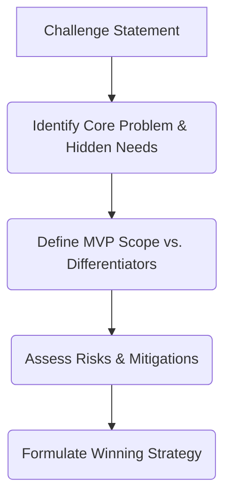

# 🚀 The Ultimate Hackathon & Challenge Winning Workflow
> A systematic, Google-First blueprint designed to transform any challenge statement into a winning submission.

---

## 📋 Phase 1: Inputs & Intake
When a new challenge goes live, the process begins by capturing all constraints and requirements.

### 📥 What You Provide
Provide the complete challenge details:
* **Full Problem Statement:** The core description and prompt.
* **Judging Criteria:** How the submission will be scored (e.g., innovation, feasibility, UX).
* **Required Technologies:** Any mandatory platforms, APIs, or frameworks.
* **Submission Requirements:** Video length, repository access, demo links, documentation.
* **Time Limit:** Exact deadline and milestones.
* **Credits & Resources:** Google Cloud credits, Vertex AI access, or specific API keys provided.
* **Special Rules:** Restrictive parameters (e.g., no pre-existing code, open-source rules).

---

## 🔍 Phase 2: Challenge Analysis
Before writing code or designing documents, we perform a deep-dive analysis.

> [!IMPORTANT]
> **Objective:** Identify the fastest path to a high-impact, winning submission.



We will explicitly document:
1. **Core Problem:** The primary pain point to solve.
2. **Hidden Requirements:** Unspoken expectations of judges (e.g., scalability, accessibility).
3. **Judging Priorities:** Which areas carry the most weight.
4. **MVP Features:** The non-negotiable core functionality.
5. **High-Impact Differentiators:** "Wow" features (e.g., advanced AI features, premium UI animations).
6. **Risks & Blockers:** Technical or timing risks and their workarounds.
7. **Fastest Path to Dev:** Immediate next steps.

---

## 📄 Phase 3: The 6 Foundation Documents
We compile six structured specification documents to align design, backend, frontend, and integration.

| Document | Purpose & Output | Best Model AI |
| :--- | :--- | :--- |
| **1. PRD (Product Requirements Document)** | Product vision, target users, user stories, MVP scope, success metrics. | **Claude Opus 4.6 Thinking** |
| **2. TRD (Technical Requirements Document)** | System architecture, APIs, authentication, deployment, security, Google-First stack choices. | **Gemini 3.1 Pro High** |
| **3. App Flow** | Screens, navigation logic, user journeys, success/error states. | **Claude Opus 4.6 Thinking** |
| **4. UI/UX Brief** | Premium UI direction, design system tokens, key components, responsiveness, dashboard structure. | **Claude Opus 4.6 Thinking** |
| **5. Backend Schema** | Firestore collections, relationships, permissions, database security rules. | **Gemini 3.1 Pro High** |
| **6. Implementation Plan** | Detailed build order, step-by-step milestones, and deliverables. | **Gemini 3.1 Pro High** |

---

## 🛡️ Phase 4: Google-First Tech Stack Rule
To build high-performance, scalable, and secure applications, we enforce a strict **Google-First** architectural rule.

> [!TIP]
> We will prioritize native integration, ease of deployment, and high reliability using Google Cloud and Firebase.

| Service | Google-First Technology | Why It Wins |
| :--- | :--- | :--- |
| **Authentication** | **Firebase Auth** | Quick setup, secure, supports OAuth providers, easy SDK integration. |
| **Primary Database** | **Firestore** | Real-time listeners, offline support, flexible document model. |
| **Relational DB** | **Cloud SQL** (PostgreSQL/MySQL) | Used only if strict relational constraints/complex transactions are required. |
| **Serverless Backend** | **Cloud Functions** (Firebase/GCP) | Event-driven, scales to zero, zero-infrastructure management. |
| **Container Backend** | **Cloud Run** | Great for full microservices, custom runtimes, and fast containerized APIs. |
| **Generative AI** | **Gemini API** / **Vertex AI** | State-of-the-art multimodal reasoning, low latency, powerful structured outputs. |
| **File Storage** | **Cloud Storage** / **Firebase Storage** | Secure, highly scalable blob storage for user uploads, media, and assets. |
| **Web Hosting** | **Firebase Hosting** | Globally distributed CDN, automatic SSL certificates, fast deployment. |
| **Monitoring** | **Google Cloud Monitoring** (Logging & Trace) | Real-time observability, custom metrics, and crash reporting. |
| **Analytics** | **Firebase Analytics** | Out-of-the-box user flow tracking, event metrics, and user engagement logs. |

---

## 🛠️ Phase 5: Build Phase
Execution is divided into focused frontend, backend, and integration streams.

```
┌────────────────────────────────────────────────────────────────────────┐
│                              BUILD PHASE                               │
├──────────────────────────┬──────────────────────┬──────────────────────┤
│         FRONTEND         │       BACKEND        │     INTEGRATION      │
├──────────────────────────┼──────────────────────┼──────────────────────┤
│ Claude Opus 4.6 Thinking │ Gemini 3.1 Pro High  │ Gemini 3.1 Pro High  │
├──────────────────────────┼──────────────────────┼──────────────────────┤
│ • Premium Visual UI      │ • Secure APIs        │ • API Connections    │
│ • Fluid Animations       │ • Firestore Setup    │ • End-to-End Testing │
│ • Responsive Layout      │ • Firebase Auth      │ • Performance Tuning │
│ • Judge-Friendly Demo    │ • Vertex AI Prompts  │ • Fix Blockers       │
└──────────────────────────┴──────────────────────┴──────────────────────┘
```

---

## 🩺 Phase 6: Post-Build Audits & Quality Control
Before declaring the build complete, we run a rigorous checklist of verification audits.

### 🔍 1. Full Code Audit
* **Architecture Review:** Ensure structural modularity and separation of concerns.
* **Performance Review:** Bundle sizes, initial page load speed, optimization of media.
* **Bug Review:** Handling edge-cases, error-handling validation, offline gracefully.

### 🔒 2. Security Audit
* **Secrets Management:** Double-check that all secrets (API keys, service account keys) are stored in Cloud Secret Manager or environment variables (`.env`). No hardcoded secrets.
* **Rate Limiting:** Protect APIs against abuse.
* **Input Validation:** Clean all data entries, check payloads.
* **Authentication:** Verify token validation, stateful sessions, and authorization checks on every endpoint.
* **Database Security:** Enforce robust Firestore Security Rules (avoiding `allow read, write: if true;`).
* **CORS & Headers:** Secure request origins, implement helmet/security headers.
* **File Uploads:** Validate file sizes, mime-types, and scan for malicious payloads.
* **AI Security:** Prompt injection checks, content safety filter configs.

### 🐙 3. GitHub Audit
* Verify `.gitignore` is fully configured (ignoring node_modules, `.env`, credentials).
* Check that no large binaries or secrets have slipped into Git history.

### 🚀 4. Production Readiness
* Verify clean production build output without warning flags.
* Deploy to target hosting environment and verify configuration.

---

## 🏆 Phase 7: Pitch & Submission Deliverables
We build professional documentation and media to pitch the project clearly to judges.

* **`README.md`:** Standardized overview, quick start, architecture description, and setup guide.
* **`PPT.md`:** Slide-by-slide markdown outline for pitch decks.
* **Architecture explanation:** Detailed system design diagrams and choices.
* **Demo Script:** Step-by-step path for a flawless walkthrough recording.
* **Judge Pitch:** A compelling 1-2 sentence hook highlighting the core value proposition.
* **Technical Highlights:** Highlighting advanced algorithms, low latency, or Google Cloud integrations.
* **Innovation Highlights:** Why this solution is creative and unique.
* **Roadmap:** Future scaling plan, additional features, and monetization strategies.

---

## 🎯 Final Alignment
Every challenge proceeds through this linear lifecycle:
$$\text{Problem Statement} \longrightarrow \text{Analysis} \longrightarrow \text{6 Documents} \longrightarrow \text{Google-First Build} \longrightarrow \text{Audits} \longrightarrow \text{Deliverables} \longrightarrow \text{Winning Submission}$$
